# Data Warehouse & Business Intelligence

## Cuprins

- [1. Modelul ales](#1-modelul-ales)
- [2. Diagrame OLTP](#2-diagrame-oltp)
    - [2.a Diagrama ERD](#2a-diagrama-erd)
    - [2.b Diagrama conceptuală](#2b-diagrama-conceptuală)
- [3. Diagrama stea](#3-diagrama-stea)
- [4. Descrierea câmpurilor necesare pentru fiecare tabel din baza de date depozit și modul de populare al acestora cu informații din baza de date OLAP.](#4-descrierea-câmpurilor-necesare-pentru-fiecare-tabel-din-baza-de-date-depozit-și-modul-de-populare-al-acestora-cu-informații-din-baza-de-date-olap)
    - [Tabela `TIMP`](#tabela-timp)
    - [Tabela `LOCATIE`](#tabela-locatie)
    - [Tabela `INFORMATII_ANGAJAT`](#tabela-informatii_angajat)
    - [Tabela `ISTORIC_ANGAJAT`](#tabela-istoric_angajat)
    - [Tabela `COFETARIE`](#tabela-cofetarie)
    - [Tabela `PRODUS`](#tabela-produs)
    - [Tabela `COMANDA_FINALIZATA`](#tabela-comanda_finalizata)
    - [Tabela `CLIENT`](#tabela-client)
    - [Tabela `COMANDA`](#tabela-comanda)
    - [Tabela `INCASARE`](#tabela-incasare)
    - [Tabela `PLATA`](#tabela-plata)
    - [Popularea tabelelor din OLAP](#popularea-tabelelor-din-olap)
- [5. Identificarea constrângerilor specifice depozitelor de date ce trebuie definite, justificând alegerea făcută](#5-identificarea-constrângerilor-specifice-depozitelor-de-date-ce-trebuie-definite-justificând-alegerea-făcută)
    - [Tabelul `timp`](#tabelul-timp)
    - [Tabelul `locatie`](#tabelul-locatie)
    - [Tabelul `informatii_angajat`](#tabelul-informatii_angajat)
    - [Tabelul `istoric_angajat`](#tabelul-istoric_angajat)
    - [Tabelul `cofetarie`](#tabelul-cofetarie)
    - [Tabelul `produs`](#tabelul-produs)
    - [Tabelul `comanda_finalizata`](#tabelul-comanda_finalizata)
    - [Tabelul `client`](#tabelul-client)
    - [Tabelul `comanda`](#tabelul-comanda)
    - [Tabelul `incasare`](#tabelul-incasare)
    - [Tabelul `plata`](#tabelul-plata)
- [6. Indecși Bitmap](#6-indecși-bitmap)
- [7. Obiectele dimensiune](#7-obiectele-dimensiune)
    - [Validarea datelor](#validarea-datelor)
- [8. Partiționări](#8-partiționări)
- [9. Optimizarea unei cereri](#9-optimizarea-unei-cereri)
    - [Partiționarea](#partiționarea)
    - [Indecși bitmap join](#indecși-bitmap-join)
    - [Vizualizare materializată](#vizualizare-materializată)
- [10. Interogari avansate specifice bazelor de date depozit](#10-interogari-avansate-specifice-bazelor-de-date-depozit)
    - [10.1 Să se afle statisticle pentru pozițiile curente ale cofetarilor din fiecare cofetărie](#101-să-se-afle-statisticle-pentru-pozițiile-curente-ale-cofetarilor-din-fiecare-cofetărie)
    - [10.2 Să se compare salariile curente și cele istorice pentru: (tip angajat, an start, tip cofetarie), (tip angajat, tip cofetarie), (tip angajat, an start), (tip cofetarie), (tip angajat), (an start), (per total).](#102-să-se-compare-salariile-curente-și-cele-istorice-pentru-tip-angajat-an-start-tip-cofetarie-tip-angajat-tip-cofetarie-tip-angajat-an-start-tip-cofetarie-tip-angajat-an-start-per-total)
    - [10.3 Să se afle numărul de comenzi, suma totală și data de încasare într-un interval specificat pentru fiecare: (tip de plată, oraș), (tip de plată, județ), (tip de plată, zonă), (tip de plată), (per total)](#103-să-se-afle-numărul-de-comenzi-suma-totală-și-data-de-încasare-într-un-interval-specificat-pentru-fiecare-tip-de-plată-oraș-tip-de-plată-județ-tip-de-plată-zonă-tip-de-plată-per-total)
    - [10.4 Să se afle clienții cu cele mai multe cumpărături din fiecare cofetărie cu servire și per total din cofetăriile cu servire într-un interval de timp specificat](#104-să-se-afle-clienții-cu-cele-mai-multe-cumpărături-din-fiecare-cofetărie-cu-servire-și-per-total-din-cofetăriile-cu-servire-într-un-interval-de-timp-specificat)
    - [10.5 Să se afle cele mai vândute produse în funcție de: (tip produs, tip cofetarie, oraș), (tip produs, tip cofetărie), (tip produs, oraș), (tip produs)](#105-să-se-afle-cele-mai-vândute-produse-în-funcție-de-tip-produs-tip-cofetarie-oraș-tip-produs-tip-cofetărie-tip-produs-oraș-tip-produs)
    - [10.6 Să se compare profitul comenzilor cu discount și fără discount pe: (lună), (lună, tip produs), (lună, tip cofetărie)](#106-să-se-compare-profitul-comenzilor-cu-discount-și-fără-discount-pe-lună-lună-tip-produs-lună-tip-cofetărie)
    - [10.7 Să se afle cele mai vândute sucuri din fiecare semestru](#107-să-se-afle-cele-mai-vândute-sucuri-din-fiecare-semestru)
    - [10.8 Să se afle profitabilitatea tipurilor de cofetării într-un interval de timp specificat](#108-să-se-afle-profitabilitatea-tipurilor-de-cofetării-într-un-interval-de-timp-specificat)
    - [10.9 Să se afle statisticile pentru fiecare tip de plată într-un interval specificat](#109-să-se-afle-statisticile-pentru-fiecare-tip-de-plată-într-un-interval-specificat)


### 1. Modelul ales

Modelul de date gestionează informații legate de administrarea și funcționarea unui lanț de cofetării.

În mai multe locații din țară sunt cofetării, fiecare având angajați care se ocupă de producerea, vânzarea și livrarea produselor. Fiecare angajat are și un istoric în cadrul lanțului de cofetării. Activitatea și organizarea cofetarilor în procesul de preparare a produselor nu intră în proiectarea modelului. Pentru aceștia se cunoaște specializarea.
Clienții pot crea comenzi ce conțin unul sau mai multe produse și care sunt livrate la o anumită locație de șoferii angajați. Ei beneficiază și de discount-uri la preț, în funcție de câte prăjituri servesc/comandă.
La dispoziția clienților stau chelnerii, care îi pot asista în crearea unei comenzi.

În continuare, vom analiza evoluția vânzărilor, a plăților și a angajaților.

### 2. Diagrame OLTP

#### 2.a Diagrama ERD


#### 2.b Diagrama conceptuală

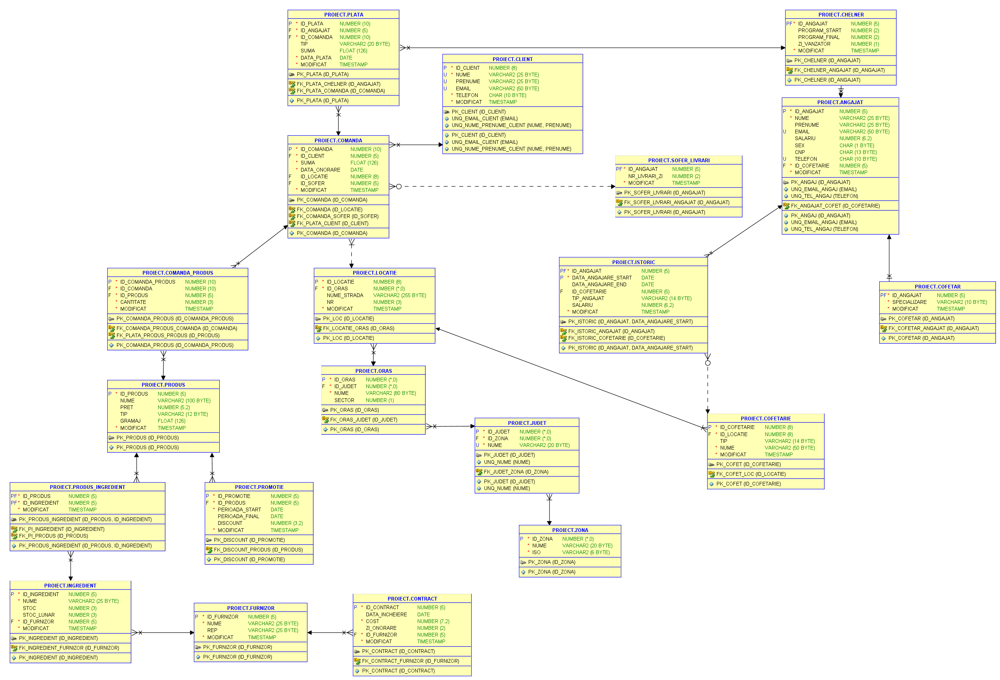

### 3. Diagrama stea

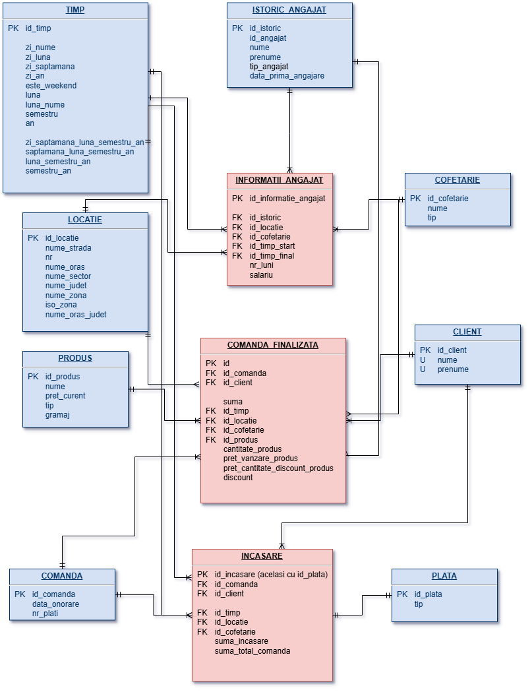

### 4. Descrierea câmpurilor necesare pentru fiecare tabel din baza de date depozit și modul de populare al acestora cu informații din baza de date OLAP.

#### Tabela `TIMP`

- `id_timp`: number(13, 0), Identifică în mod unic fiecare înregistrare de timp.
- `zi_nume`: varchar(20), Numele zilei.
- `zi_luna`: number(2, 0), Ziua lunii.
- `zi_saptamana`: number(1, 0), Ziua săptămânii.
- `zi_an`: number(3, 0), Ziua anului.
- `este_weekend`: number(1, 0), Indica dacă ziua este în weekend.
- `luna`: number(2, 0), Luna anului.
- `luna_nume`: varchar(20), Numele lunii.
- `trimestru`: number(1, 0).
- `semestru`: number(1, 0).
- `an`: number(4, 0), Anul.
- `saptamana_luna`: number(2, 0), Săptămâna lunii.
- `zi_saptamana_luna_semestru_an`: varchar(160), Pentru ierarhie.
- `saptamana_luna_semestru_an`: varchar(120), Pentru ierarhie.
- `luna_semestru_an`: varchar(80), Pentru ierarhie.
- `semestru_an`: varchar(40), Pentru ierarhie.

#### Tabela `LOCATIE`

- `id_locatie`: number(8, 0), Identifică în mod unic fiecare locație.
- `nume_strada`: varchar2(255), Numele străzii pe care se află locația.
- `nr`: number(4, 0), Numărul adresei.
- `nume_oras`: varchar2(60), Numele orașului în care se află locația.
- `nume_sector`: varchar2(1), Numele sectorului în care se află locația (dacă este aplicabil).
- `nume_judet`: varchar2(30), Numele județului în care se află locația.
- `nume_zona`: varchar2(20), Numele zonei geografice în care se află locația.
- `iso_zona`: varchar2(10), Codul ISO al zonei geografice în care se află locația.
- `nume_oras_judet`: varchar(100), Pentru ierarhie.

#### Tabela `INFORMATII_ANGAJAT`

- `id_informatie_angajat`: number(6, 0), Identifică în mod unic fiecare înregistrare din informațiile angajaților.
- `id_istoric`: number(6, 0), Identifică istoricul angajatului.
- `id_locatie`: number(6, 0), Identifică locația unde a lucrat angajatul.
- `id_cofetarie`: number(6, 0), Identifică cofetăria unde a lucrat angajatul.
- `id_timp_start`: number(13, 0), Identifică momentul de început al perioadei de lucru.
- `id_timp_final`: number(13, 0), Identifică momentul de sfârșit al perioadei de lucru.
- `nr_luni`: number(4), Numărul de luni lucrate în perioada specificată.
- `salariu`: number(10), Salariul angajatului pentru perioada specificată.

#### Tabela `ISTORIC_ANGAJAT`

- `id_istoric`: number(6, 0), Identifică în mod unic fiecare înregistrare din istoricul angajaților.
- `id_angajat`: number(6, 0), Identifică angajatul specific.
- `nume`: varchar2(30), Numele angajatului.
- `prenume`: varchar2(30), Prenumele angajatului.
- `tip_angajat`: varchar2(14), Tipul angajatului. Poate lua următoarele valori: 'sofer_livrator', 'cofetar', 'chelner'.
- `data_prima_angajare`: number(13, 0), Data primei angajări.

#### Tabela `COFETARIE`

- `id_cofetarie`: number(6, 0), Identifică în mod unic fiecare cofetărie.
- `nume`: varchar2(50), Numele cofetăriei.
- `tip`: varchar2(14), Tipul cofetăriei.

#### Tabela `PRODUS`

- `id_produs`: number(6, 0), Identifică în mod unic fiecare produs.
- `nume`: varchar2(25), Numele produsului.
- `pret_curent`: number(5, 2), Prețul curent al produsului.
- `tip`: varchar2(12), Tipul produsului.
- `gramaj`: float, Greutatea produsului.

#### Tabela `COMANDA_FINALIZATA`

- `id`: number(12, 0), Identifică în mod unic fiecare comandă finalizată.
- `id_comanda`: number(12, 0), Identifică comanda.
- `id_client`: number(6, 0), Identifică clientul.
- `suma`: float, Suma totală a comenzii.
- `id_timp`: number(13, 0), Identifică momentul finalizării comenzii.
- `id_locatie`: number(6, 0), Identifică locația unde a fost finalizată comanda.
- `id_cofetarie`: number(6, 0), Identifică cofetăria unde a fost finalizată comanda.
- `id_produs`: number(6, 0), Identifică produsul comandat.
- `cantitate_produs`: number(3, 0), Cantitatea produsului comandat.
- `pret_vanzare_produs`: float, Prețul de vânzare al produsului.
- `pret_cantitate_discount_produs`: float, Prețul cu discount pentru cantitatea produsului.
- `discount`: number(3, 2), Discount aplicat.

#### Tabela `CLIENT`

- `id_client`: number(6, 0), Identifică în mod unic fiecare client.
- `nume`: varchar2(25), Numele clientului.
- `prenume`: varchar2(25), Prenumele clientului.

#### Tabela `COMANDA`

- `id_comanda`: number(12, 0), Identifică în mod unic fiecare comandă.
- `data_onorare`: number(13, 0), Data onorării comenzii.
- `nr_plati`: number(1, 0), Numărul de plăți pentru comandă.

#### Tabela `INCASARE`

- `id_incasare`: number(12, 0), Identifică în mod unic fiecare încasare.
- `id_comanda`: number(12, 0), Identifică comanda.
- `id_client`: number(6, 0), Identifică clientul.
- `id_timp`: number(13, 0), Identifică momentul încasării.
- `id_locatie`: number(6, 0), Identifică locația încasării.
- `id_cofetarie`: number(6, 0), Identifică cofetăria încasării.
- `suma_incasare`: float, Suma încasată.
- `suma_total_comanda`: float, Suma totală a comenzii.

#### Tabela `PLATA`

- `id_plata`: number(12, 0), Identifică în mod unic fiecare plată.
- `tip`: varchar2(20), Tipul plății.

#### Popularea tabelelor din OLAP

Popularea în **OLTP** se face printr-un script de TypeScript rulat în runtime-ul *Deno*, folosindu-ne de librăria `oracledb` pentru rularea cererilor. Ea se face cu date generate de librăria `Faker`, ceea ce ne-a permis popularea tabelelor cu date de ordinul sutelor de mii. 

Pentru popularea în **OLAP**, tot din TypeScript se face migrarea inițială a datelor din OLTP, moment în care se și înregistrează operația în `MIGRARE`. Astfel, se disting datele care au fost modificate sau adăugate între timp în OLTP și care trebuie aduse în OLAP. Pentru a se face operațiile de migrare din front-end, avem și un REST API care expune acțiunile pentru fiecare tabelă.

Pentru a eficientiza inserările bulk în **OLAP**, am modificat comportamentul implicit de extindere a tablespace-ului `user` și `undo`.

```sql
ALTER DATABASE DATAFILE '/opt/oracle/oradata/ORCLCDB/users01.dbf' AUTOEXTEND ON NEXT 50M MAXSIZE UNLIMITED;
ALTER DATABASE DATAFILE '/opt/oracle/oradata/ORCLCDB/undotbs01.dbf' AUTOEXTEND ON NEXT 50M MAXSIZE UNLIMITED;
```

 În plus, cheile primare și constrângerile de unicitate sunt active pentru găsirea conflictelor la upsert, odată cu migrarea în OLAP, dar și pentru cererile făcute ulterior, specifice DW. Exemplu de cerere de tip `MERGE INTO` folosită la migrare:

```sql
MERGE INTO comanda cmd
USING (
    SELECT
        :id_comanda   AS id_comanda,
        :data_onorare AS data_onorare,
        :nr_plati     AS nr_plati
    FROM
        dual
) new_cmd ON ( cmd.id_comanda = new_cmd.id_comanda )
WHEN MATCHED THEN UPDATE
SET cmd.data_onorare = new_cmd.data_onorare,
    cmd.nr_plati = new_cmd.nr_plati
WHEN NOT MATCHED THEN
INSERT (
    id_comanda,
    data_onorare,
    nr_plati )
VALUES
    ( new_cmd.id_comanda,
      new_cmd.data_onorare,
      new_cmd.nr_plati )
```
<!-- #### Tabela `ZONA`

- `id_zona`: `smallint`, Identifică în mod unic fiecare zonă.
- `nume`: `varchar2(20)`, Numele zonei.
- `iso`: `varchar2(6)`, Codul ISO al zonei.

#### Tabela `JUDET`

- `id_judet`: `smallint`, Identifică în mod unic fiecare județ.
- `id_zona`: `smallint`, Identifică zona specifică.
- `nume`: `varchar2(20)`, Numele județului.

#### Tabela `ORAS`

- `id_oras`: `int`, Identifică în mod unic fiecare oraș.
- `id_judet`: `smallint`, Identifică județul specific.
- `nume`: `varchar2(80)`, Numele orașului.
- `sector`: `number(1)`, Sectorul orașului (dacă este cazul).

#### Tabela `LOCATIE`

- `id_locatie`: `number(8, 0)`, Identifică în mod unic fiecare locație.
- `id_oras`: `int`, Identifică orașul specific.
- `nume_strada`: `varchar2(255)`, Numele străzii pe care se află locația.
- `nr`: `number(4, 0)`, Numărul adresei.
- `modificat`: `timestamp`, Data și ora ultimei modificări.

#### Tabela `COFETARIE`

- `id_cofetarie`: `number(8, 0)`, Identifică în mod unic fiecare cofetărie.
- `id_locatie`: `number(8, 0)`, Identifică locația specifică.
- `tip`: `varchar2(14)`, Tipul cofetăriei (fără servire sau cu servire).
- `nume`: `varchar2(50)`, Numele cofetăriei.
- `modificat`: `timestamp`, Data și ora ultimei modificări.

#### Tabela `ANGAJAT`

- `id_angajat`: `number(5, 0)`, Identifică în mod unic fiecare angajat.
- `nume`: `varchar2(25)`, Numele angajatului.
- `prenume`: `varchar2(25)`, Prenumele angajatului.
- `email`: `varchar2(50)`, Email-ul angajatului.
- `salariu`: `number(6, 2)`, Salariul angajatului.
- `sex`: `char(1)`, Sexul angajatului (M/F).
- `cnp`: `char(13)`, Codul Numeric Personal al angajatului.
- `telefon`: `char(10)`, Numărul de telefon al angajatului.
- `id_cofetarie`: `number(5, 0)`, Identifică cofetăria unde lucrează angajatul.
- `modificat`: `timestamp`, Data și ora ultimei modificări.

#### Tabela `COFETAR`

- `id_angajat`: `number(5, 0)`, Identifică în mod unic fiecare cofetar.
- `specializare`: `varchar2(10)`, Specializarea cofetarului.
- `modificat`: `timestamp`, Data și ora ultimei modificări.

#### Tabela `CHELNER`

- `id_angajat`: `number(5, 0)`, Identifică în mod unic fiecare chelner.
- `program_start`: `number(2, 0)`, Ora de început a programului.
- `program_final`: `number(2, 0)`, Ora de final a programului.
- `zi_vanzator`: `number(1, 0)`, Ziua în care chelnerul este vânzător.
- `modificat`: `timestamp`, Data și ora ultimei modificări.

#### Tabela `SOFER_LIVRARI`

- `id_angajat`: `number(5, 0)`, Identifică în mod unic fiecare șofer livrator.
- `nr_livrari_zi`: `number(2, 0)`, Numărul de livrări pe zi.
- `modificat`: `timestamp`, Data și ora ultimei modificări.

#### Tabela `ISTORIC`

- `id_angajat`: `number(5, 0)`, Identifică angajatul specific.
- `data_angajare_start`: `date`, Data de început a angajării.
- `data_angajare_end`: `date`, Data de final a angajării.
- `id_cofetarie`: `number(5, 0)`, Identifică cofetăria specifică.
- `tip_angajat`: `varchar2(14)`, Tipul angajatului.
- `salariu`: `number(6, 2)`, Salariul angajatului.
- `modificat`: `timestamp`, Data și ora ultimei modificări.

#### Tabela `CLIENT`

- `id_client`: `number(8, 0)`, Identifică în mod unic fiecare client.
- `nume`: `varchar2(25)`, Numele clientului.
- `prenume`: `varchar2(25)`, Prenumele clientului.
- `email`: `varchar2(50)`, Email-ul clientului.
- `telefon`: `char(10)`, Numărul de telefon al clientului.
- `modificat`: `timestamp`, Data și ora ultimei modificări.

#### Tabela `COMANDA`

- `id_comanda`: `number(10, 0)`, Identifică în mod unic fiecare comandă.
- `id_client`: `number(5, 0)`, Identifică clientul specific.
- `suma`: `float`, Suma totală a comenzii.
- `data_onorare`: `date`, Data onorării comenzii.
- `id_locatie`: `number(8, 0)`, Identifică locația specifică.
- `id_sofer`: `number(5, 0)`, Identifică șoferul livrator.
- `modificat`: `timestamp`, Data și ora ultimei modificări.

#### Tabela `PLATA`

- `id_plata`: `number(10, 0)`, Identifică în mod unic fiecare plată.
- `id_angajat`: `number(5, 0)`, Identifică angajatul specific.
- `id_comanda`: `number(10, 0)`, Identifică comanda specifică.
- `tip`: `varchar2(20)`, Tipul plății (chitanță, factură, avans, rest).
- `suma`: `float`, Suma plătită.
- `data_plata`: `date`, Data plății.
- `modificat`: `timestamp`, Data și ora ultimei modificări.

#### Tabela `PRODUS`

- `id_produs`: `number(5, 0)`, Identifică în mod unic fiecare produs.
- `nume`: `varchar2(100)`, Numele produsului.
- `pret`: `number(5, 2)`, Prețul produsului.
- `tip`: `varchar2(12)`, Tipul produsului (prăjitură, tort, suc).
- `gramaj`: `float`, Greutatea produsului.
- `modificat`: `timestamp`, Data și ora ultimei modificări.

#### Tabela `COMANDA_PRODUS`

- `id_comanda_produs`: `number(10, 0)`, Identifică în mod unic fiecare comandă de produs.
- `id_comanda`: `number(10, 0)`, Identifică comanda specifică.
- `id_produs`: `number(5, 0)`, Identifică produsul specific.
- `cantitate`: `number(3, 0)`, Cantitatea produsului.
- `modificat`: `timestamp`, Data și ora ultimei modificări.

#### Tabela `PROMOTIE`

- `id_promotie`: `number(5, 0)`, Identifică în mod unic fiecare promoție.
- `id_produs`: `number(5, 0)`, Identifică produsul specific.
- `perioada_start`: `date`, Data de început a promoției.
- `perioada_final`: `date`, Data de final a promoției.
- `discount`: `number(3, 2)`, Discount-ul aplicat.
- `modificat`: `timestamp`, Data și ora ultimei modificări.

#### Tabela `FURNIZOR`

- `id_furnizor`: `number(5, 0)`, Identifică în mod unic fiecare furnizor.
- `nume`: `varchar2(25)`, Numele furnizorului.
- `rep`: `varchar2(25)`, Reprezentantul furnizorului.
- `modificat`: `timestamp`, Data și ora ultimei modificări.

#### Tabela `INGREDIENT`

- `id_ingredient`: `number(5, 0)`, Identifică în mod unic fiecare ingredient.
- `nume`: `varchar2(25)`, Numele ingredientului.
- `stoc`: `number(3, 0)`, Stocul curent al ingredientului.
- `stoc_lunar`: `number(3, 0)`, Stocul lunar al ingredientului.
- `id_furnizor`: `number(5, 0)`, Identifică furnizorul specific.
- `modificat`: `timestamp`, Data și ora ultimei modificări.

#### Tabela `PRODUS_INGREDIENT`

- `id_produs`: `number(5, 0)`, Identifică produsul specific.
- `id_ingredient`: `number(5, 0)`, Identifică ingredientul specific.
- `modificat`: `timestamp`, Data și ora ultimei modificări.

#### Tabela `CONTRACT`

- `id_contract`: `number(5, 0)`, Identifică în mod unic fiecare contract.
- `data_incheiere`: `date`, Data încheierii contractului.
- `cost`: `number(7, 2)`, Costul contractului.
- `zi_onorare`: `number(2, 0)`, Ziua onorării contractului.
- `id_furnizor`: `number(5, 0)`, Identifică furnizorul specific.
- `modificat`: `timestamp`, Data și ora ultimei modificări. -->

### 5. Identificarea constrângerilor specifice depozitelor de date ce trebuie definite, justificând alegerea făcută

#### Tabelul `timp`

- Constrângere de cheie primară `pk_timp` pe coloana `id_timp`.
  - Justificare: Această constrângere servește procesului de upsert la migrare și la interogările tip DW.

#### Tabelul `locatie`

- Constrângere de cheie primară `pk_locatie` pe coloana `id_locatie`.
  - Justificare: Această constrângere servește procesului de upsert la migrare și la interogările tip DW.

#### Tabelul `informatii_angajat`

- Constrângere de cheie primară `pk_informatii_angajat` pe coloana `id_informatie_angajat`.
  - Justificare: Această constrângere servește procesului de upsert la migrare.
- Constrângere de cheie străină `fk_informatii_angajat_istoric` pe coloana `id_istoric` referință la `istoric_angajat(id_istoric)` definită cu `rely disable novalidate`.
- Constrângere de cheie străină `fk_informatii_angajat_locatie` pe coloana `id_locatie` referință la `locatie(id_locatie)` definită cu `rely disable novalidate`.
- Constrângere de cheie străină `fk_informatii_angajat_cofetarie` pe coloana `id_cofetarie` referință la `cofetarie(id_cofetarie)` definită cu `rely disable novalidate`.
- Constrângere de cheie străină `fk_informatii_angajat_timp_start` pe coloana `id_timp_start` referință la `timp(id_timp)` definită cu `rely disable novalidate`.
- Constrângere de cheie străină `fk_informatii_angajat_timp_final` pe coloana `id_timp_final` referință la `timp(id_timp)` definită cu `rely disable novalidate`.
  - Justificare: Aceste constrângeri au fost definite cu `rely disable novalidate` pentru a permite flexibilitate în timpul procesului ETL și pentru a evita validarea imediată a datelor existente.
- Constrângere unică `uq_informatii_angajat_istoric_start` pe coloanele `id_istoric` și `id_timp_start`.
  - Justificare: Această constrângere servește procesului de upsert la migrare.

#### Tabelul `istoric_angajat`

- Constrângere de cheie primară `pk_istoric_angajat` pe coloana `id_istoric`.
  - Justificare: Această constrângere servește procesului de upsert la migrare.
- Constrângere unică `uq_istoric_angajat_angajat` pe coloana `id_angajat`.
  - Justificare: Această constrângere servește procesului de upsert la migrare.

#### Tabelul `cofetarie`

- Constrângere de cheie primară `pk_cofetarie` pe coloana `id_cofetarie`.
  - Justificare: Această constrângere servește procesului de upsert la migrare și la interogările tip DW.

#### Tabelul `produs`

- Constrângere de cheie primară `pk_produs` pe coloana `id_produs`.
  - Justificare: Această constrângere servește procesului de upsert la migrare și la interogările tip DW.

#### Tabelul `comanda_finalizata`

- Constrângere de cheie primară `pk_comanda_finalizata` pe coloana `id`.
  - Justificare: Această constrângere servește procesului de upsert la migrare.
- Constrângere de cheie străină `fk_comanda_finalizata_comanda` pe coloana `id_comanda` referință la `comanda(id_comanda)` definită cu `rely disable novalidate`.
- Constrângere de cheie străină `fk_comanda_finalizata_client` pe coloana `id_client` referință la `client(id_client)` definită cu `rely disable novalidate`.
- Constrângere de cheie străină `fk_comanda_finalizata_timp` pe coloana `id_timp` referință la `timp(id_timp)` definită cu `rely disable novalidate`.
- Constrângere de cheie străină `fk_comanda_finalizata_locatie` pe coloana `id_locatie` referință la `locatie(id_locatie)` definită cu `rely disable novalidate`.
- Constrângere de cheie străină `fk_comanda_finalizata_cofetarie` pe coloana `id_cofetarie` referință la `cofetarie(id_cofetarie)` definită cu `rely disable novalidate`.
- Constrângere de cheie străină `fk_comanda_finalizata_produs` pe coloana `id_produs` referință la `produs(id_produs)` definită cu `rely disable novalidate`.
  - Justificare: Aceste constrângeri au fost definite cu `rely disable novalidate` pentru a permite flexibilitate în timpul procesului ETL și pentru a evita validarea imediată a datelor existente.
- Constrângere unică `uq_comanda_finalizata_comanda_client_produs` pe coloanele `id_comanda`, `id_client` și `id_produs`.
  - Justificare: Această constrângere servește procesului de upsert la migrare.

#### Tabelul `client`

- Constrângere de cheie primară `pk_client` pe coloana `id_client`.
  - Justificare: Această constrângere servește procesului de upsert la migrare.
- Constrângere unică `uq_client_nume_prenume` pe coloanele `nume` și `prenume`.
  - Justificare: Această constrângere servește procesului de upsert la migrare.

#### Tabelul `comanda`

- Constrângere de cheie primară `pk_comanda` pe coloana `id_comanda`.
  - Justificare: Această constrângere servește procesului de upsert la migrare.

#### Tabelul `incasare`

- Constrângere de cheie primară `pk_incasare` pe coloana `id_incasare`.
  - Justificare: Această constrângere servește procesului de upsert la migrare.
- Constrângere de cheie străină `fk_incasare_comanda` pe coloana `id_comanda` referință la `comanda(id_comanda)` definită cu `rely disable novalidate`.
- Constrângere de cheie străină `fk_incasare_client` pe coloana `id_client` referință la `client(id_client)` definită cu `rely disable novalidate`.
- Constrângere de cheie străină `fk_incasare_timp` pe coloana `id_timp` referință la `timp(id_timp)` definită cu `rely disable novalidate`.
- Constrângere de cheie străină `fk_incasare_locatie` pe coloana `id_locatie` referință la `locatie(id_locatie)` definită cu `rely disable novalidate`.
- Constrângere de cheie străină `fk_incasare_cofetarie` pe coloana `id_cofetarie` referință la `cofetarie(id_cofetarie)` definită cu `rely disable novalidate`.
  - Justificare: Aceste constrângeri au fost definite cu `rely disable novalidate` pentru a permite flexibilitate în timpul procesului ETL și pentru a evita validarea imediată a datelor existente.

#### Tabelul `plata`

- Constrângere de cheie primară `pk_plata` pe coloana `id_plata`.
  - Justificare: Această constrângere servește procesului de upsert la migrare.

### 6. Indecși Bitmap

- **CREATE BITMAP INDEX idx_tip_angajat ON istoric_angajat(tip_angajat)**
  Acest index bitmap a fost creat pentru a optimiza interogările pe coloana `tip_angajat` din tabelul `istoric_angajat`.
  Query [10.1.](#101-să-se-afle-statisticle-pentru-pozițiile-curente-ale-cofetarilor-din-fiecare-cofetărie)

- **CREATE BITMAP INDEX idx_cofetarie_tip ON cofetarie(tip)**
  Acest index bitmap a fost creat pentru a optimiza interogările pe coloana `tip` din tabelul `cofetarie`.
  Query [10.4.](#104-să-se-afle-clienții-cu-cele-mai-multe-cumpărături-din-fiecare-cofetărie-cu-servire-și-per-total-din-cofetăriile-cu-servire-într-un-interval-de-timp-specificat)

- **CREATE BITMAP INDEX idx_produs_tip ON produs(tip)**
  Acest index bitmap a fost creat pentru a optimiza interogările pe coloana `tip` din tabelul `produs`.
  Query [10.7.](#107-să-se-afle-cele-mai-vândute-sucuri-din-fiecare-semestru)

### 7. Obiectele dimensiune

```sql
create dimension dim_timp
   level timp is ( timp.id_timp )
   level zi is ( timp.zi_saptamana_luna_semestru_an )
   level saptamana is ( timp.saptamana_luna_semestru_an )
   level luna is ( timp.luna_semestru_an )
   level semestru is ( timp.semestru_an )
   level an is ( timp.an )
   hierarchy hier_timp ( timp
      child of zi
      child of saptamana
      child of luna
      child of semestru
      child of an
   )
   attribute zi determines (
      timp.zi_nume,
      timp.zi_luna,
      timp.zi_an,
      timp.este_weekend
   )
   attribute saptamana determines (
      timp.saptamana_luna
   )
   attribute luna determines (
      timp.luna_nume,
      timp.luna
   )
   attribute semestru determines (
      timp.an,
      timp.semestru
   );

create dimension dim_locatie
   level locatie is ( locatie.id_locatie )
   level oras is ( locatie.nume_oras_judet )
   level judet is ( locatie.nume_judet )
   level zona is ( locatie.nume_zona )
   hierarchy hier_locatie ( locatie
      child of oras
      child of judet
      child of zona
   )
   attribute oras determines (
      locatie.nume_oras
   )
   attribute zona determines (
      locatie.iso_zona
   );
```

#### Validarea datelor

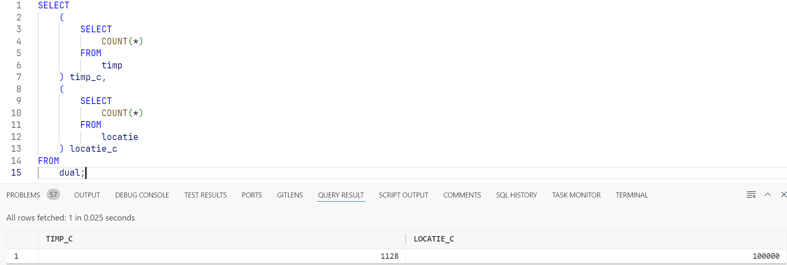

```sql
EXECUTE DBMS_DIMENSION.VALIDATE_DIMENSION(UPPER('dim_timp'),FALSE,TRUE,'st_dim_timp');

SELECT *
FROM   timp
WHERE ROWID IN (SELECT BAD_ROWID
                 FROM   DIMENSION_EXCEPTIONS
                 WHERE  STATEMENT_ID = 'st_dim_timp');


EXECUTE DBMS_DIMENSION.VALIDATE_DIMENSION(UPPER('dim_locatie'),FALSE,TRUE,'st_dim_locatie');

SELECT *
FROM   locatie
WHERE ROWID IN (SELECT BAD_ROWID
                 FROM   DIMENSION_EXCEPTIONS
                 WHERE  STATEMENT_ID = 'st_dim_locatie');
```
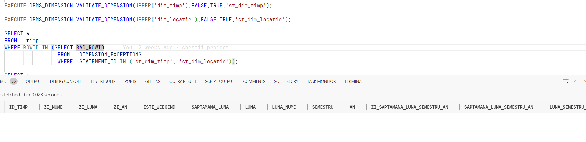

### 8. Partiționări

Am realizat partiționarea pentru tabelele:

- `PLATA`: de tip listă după _tipul de plată_,
- `INCASARE`: de tip interval după _timp_,
- `COMANDA_FINALIZATA`: de tip interval după _timp_.

```sql
CREATE TABLE incasare_timp_part
        PARTITION BY RANGE (
            id_timp
        )
        ( PARTITION january_2023
            VALUES LESS THAN ( 1675209600000 ),
        PARTITION february_2023
            VALUES LESS THAN ( 1677628800000 ),
        PARTITION march_2023
            VALUES LESS THAN ( 1680307200000 ),
        PARTITION april_2023
            VALUES LESS THAN ( 1682899200000 ),
        PARTITION may_2023
            VALUES LESS THAN ( 1685577600000 ),
        PARTITION june_2023
            VALUES LESS THAN ( 1688169600000 ),
        PARTITION july_2023
            VALUES LESS THAN ( 1690848000000 ),
        PARTITION august_2023
            VALUES LESS THAN ( 1693526400000 ),
        PARTITION september_2023
            VALUES LESS THAN ( 1696118400000 ),
        PARTITION october_2023
            VALUES LESS THAN ( 1698796800000 ),
        PARTITION november_2023
            VALUES LESS THAN ( 1701388800000 ),
        PARTITION december_2023
            VALUES LESS THAN ( 1704067200000 ),
        PARTITION january_2024
            VALUES LESS THAN ( 1706745600000 ),
        PARTITION february_2024
            VALUES LESS THAN ( 1709164800000 ),
        PARTITION march_2024
            VALUES LESS THAN ( 1711843200000 ),
        PARTITION april_2024
            VALUES LESS THAN ( 1714435200000 ),
        PARTITION may_2024
            VALUES LESS THAN ( 1717113600000 ),
        PARTITION june_2024
            VALUES LESS THAN ( 1719705600000 ),
        PARTITION july_2024
            VALUES LESS THAN ( 1722384000000 ),
        PARTITION august_2024
            VALUES LESS THAN ( 1725062400000 ),
        PARTITION september_2024
            VALUES LESS THAN ( 1727654400000 ),
        PARTITION october_2024
            VALUES LESS THAN ( 1730332800000 ),
        PARTITION november_2024
            VALUES LESS THAN ( 1732924800000 ),
        PARTITION december_2024
            VALUES LESS THAN ( 1735603200000 ),
        PARTITION max_partition
            VALUES LESS THAN ( MAXVALUE )
        )
    AS
        SELECT
            *
        FROM
            incasare;

CREATE TABLE plata_tip_part
        PARTITION BY LIST ( tip ) ( PARTITION avans VALUES ( 'avans' ),
            PARTITION chitanta VALUES ( 'chitanta' ),
            PARTITION rest VALUES ( 'rest' ),
            PARTITION factrua VALUES ( 'factrua' ),
            PARTITION max_partition VALUES ( DEFAULT )
        )
    AS
        SELECT
            *
        FROM
            plata;

CREATE TABLE comanda_finalizata_timp_part
        PARTITION BY RANGE (
            id_timp
        )
        ( PARTITION january_2023
            VALUES LESS THAN ( 1675209600000 ),
        PARTITION february_2023
            VALUES LESS THAN ( 1677628800000 ),
        PARTITION march_2023
            VALUES LESS THAN ( 1680307200000 ),
        PARTITION april_2023
            VALUES LESS THAN ( 1682899200000 ),
        PARTITION may_2023
            VALUES LESS THAN ( 1685577600000 ),
        PARTITION june_2023
            VALUES LESS THAN ( 1688169600000 ),
        PARTITION july_2023
            VALUES LESS THAN ( 1690848000000 ),
        PARTITION august_2023
            VALUES LESS THAN ( 1693526400000 ),
        PARTITION september_2023
            VALUES LESS THAN ( 1696118400000 ),
        PARTITION october_2023
            VALUES LESS THAN ( 1698796800000 ),
        PARTITION november_2023
            VALUES LESS THAN ( 1701388800000 ),
        PARTITION december_2023
            VALUES LESS THAN ( 1704067200000 ),
        PARTITION january_2024
            VALUES LESS THAN ( 1706745600000 ),
        PARTITION february_2024
            VALUES LESS THAN ( 1709164800000 ),
        PARTITION march_2024
            VALUES LESS THAN ( 1711843200000 ),
        PARTITION april_2024
            VALUES LESS THAN ( 1714435200000 ),
        PARTITION may_2024
            VALUES LESS THAN ( 1717113600000 ),
        PARTITION june_2024
            VALUES LESS THAN ( 1719705600000 ),
        PARTITION july_2024
            VALUES LESS THAN ( 1722384000000 ),
        PARTITION august_2024
            VALUES LESS THAN ( 1725062400000 ),
        PARTITION september_2024
            VALUES LESS THAN ( 1727654400000 ),
        PARTITION october_2024
            VALUES LESS THAN ( 1730332800000 ),
        PARTITION november_2024
            VALUES LESS THAN ( 1732924800000 ),
        PARTITION december_2024
            VALUES LESS THAN ( 1735603200000 ),
        PARTITION max_partition
            VALUES LESS THAN ( MAXVALUE )
        )
    AS
        SELECT
            *
        FROM
            comanda_finalizata;
```

Pentru a utiliza aceste partiționări am creat următoarele cereri:

1. Grupat, pe rând, pe tuplurile (oraș, județ, zonă, tip plată), (județ, zonă, tip plată), (zonă, tip plată), tip_plată și la final pe întreg, să se obțină câte încasări s-au făcut, suma încasată, raportul încasărilor din total, rancurile asociate și procentul din total al încasărilor. Interogarea se va face pe un interval de timp, preferabil venit de la client, și tipuri de plăți.

```sql
SELECT
    p.tip,
    l.nume_zona,
    l.nume_judet,
    l.nume_oras_judet,
    COUNT(*)                                                                            AS cnt,
    SUM(i.suma_incasare)                                                                AS suma_incasare,
    SUM(i.suma_total_comanda) / SUM(i.suma_incasare)                                    AS rata_incasare,
    GROUPING_ID(p.tip)                                                                  gr_p_tip,
    GROUPING_ID(l.nume_zona)                                                            gr_l_nume_zona,
    GROUPING_ID(l.nume_judet)                                                           gr_l_nume_judet,
    GROUPING_ID(l.nume_oras_judet)                                                      gr_l_nume_oras_judet,
    DENSE_RANK()
    OVER(PARTITION BY GROUPING_ID(p.tip, l.nume_zona, l.nume_judet, l.nume_oras_judet)
         ORDER BY
             COUNT(*) DESC
    )                                                                                   AS rank_desc_cnt_tip_locatie,
    DENSE_RANK()
    OVER(PARTITION BY GROUPING_ID(l.nume_zona, l.nume_judet, l.nume_oras_judet)
         ORDER BY
             COUNT(*) DESC
    )                                                                                   AS rank_desc_cnt_locatie,
    DENSE_RANK()
    OVER(PARTITION BY GROUPING_ID(p.tip, l.nume_zona, l.nume_judet, l.nume_oras_judet)
         ORDER BY
             SUM(i.suma_incasare) DESC
    )                                                                                   AS rank_desc_suma_incasare_tip_locatie,
    DENSE_RANK()
    OVER(PARTITION BY GROUPING_ID(l.nume_zona, l.nume_judet, l.nume_oras_judet)
         ORDER BY
             SUM(i.suma_incasare) DESC
    )                                                                                   AS rank_desc_suma_incasare_locatie,
    RATIO_TO_REPORT(COUNT(*))
    OVER(PARTITION BY GROUPING_ID(p.tip, l.nume_zona, l.nume_judet, l.nume_oras_judet)) AS rtr_cnt_tip_locatie,
    RATIO_TO_REPORT(COUNT(*))
    OVER(PARTITION BY GROUPING_ID(l.nume_zona, l.nume_judet, l.nume_oras_judet))        AS rtr_cnt_locatie,
    RATIO_TO_REPORT(SUM(i.suma_incasare))
    OVER(PARTITION BY GROUPING_ID(p.tip, l.nume_zona, l.nume_judet, l.nume_oras_judet)) AS rtr_suma_incasare_tip_locatie,
    RATIO_TO_REPORT(SUM(i.suma_incasare))
    OVER(PARTITION BY GROUPING_ID(l.nume_zona, l.nume_judet, l.nume_oras_judet))        AS rtr_suma_incasare_locatie
FROM
         incasare_timp_part i
    JOIN plata_tip_part p ON i.id_incasare = p.id_plata
    JOIN locatie        l ON i.id_locatie = l.id_locatie
    JOIN timp           t ON i.id_timp = t.id_timp
WHERE
    t.id_timp BETWEEN 1675209600000 AND 1677628800000
    AND p.tip IN ( 'chitanta', 'avans' )
GROUP BY
    ROLLUP(p.tip,
           l.nume_zona,
           l.nume_judet,
           l.nume_oras_judet);
```

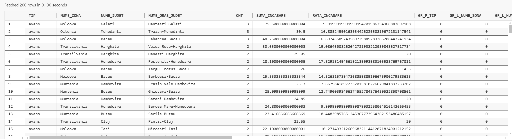

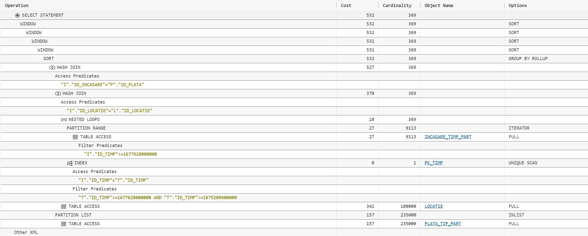

2. Să se obțină, în toate combinațiile posibile, după tip cofetărie, tip plată, an, semestru, lună, săptămâni și zile, profitul, rancurile, diferența în scară, suma totală, numărul total per combinație, rația, distribuțuia cumulativă și alte statistici de interes.

```sql
SELECT
    t.zi_saptamana_luna_semestru_an,
    t.saptamana_luna_semestru_an,
    t.luna_semestru_an,
    t.semestru_an,
    t.an,
    p.tip                                     AS produs_tip,
    cft.tip                                   AS cofetarie_tip,
    SUM(cf.suma)                              AS profit,
    GROUPING_ID(t.zi_saptamana_luna_semestru_an, t.saptamana_luna_semestru_an, t.luna_semestru_an, t.semestru_an, t.an,
                p.tip, cft.tip)               AS gid,
    DENSE_RANK()
    OVER(PARTITION BY GROUPING_ID(t.zi_saptamana_luna_semestru_an, t.saptamana_luna_semestru_an, t.luna_semestru_an, t.semestru_an, t.an
    ,
                                  p.tip, cft.tip)
         ORDER BY
             SUM(cf.suma) DESC
    )                                         d_rank,
    SUM(cf.suma) - LAG(SUM(cf.suma),
    1)
                   OVER(PARTITION BY GROUPING_ID(t.zi_saptamana_luna_semestru_an, t.saptamana_luna_semestru_an, t.luna_semestru_an, t.semestru_an
                   , t.an,
                                                 p.tip, cft.tip)
                        ORDER BY
                            SUM(cf.suma) DESC
    )                                         AS dif,
    SUM(SUM(cf.suma))
    OVER(PARTITION BY GROUPING_ID(t.zi_saptamana_luna_semestru_an, t.saptamana_luna_semestru_an, t.luna_semestru_an, t.semestru_an, t.an
    ,
                                  p.tip, cft.tip))                  AS suma_totala,
    COUNT(*)
    OVER(PARTITION BY GROUPING_ID(t.zi_saptamana_luna_semestru_an, t.saptamana_luna_semestru_an, t.luna_semestru_an, t.semestru_an, t.an
    ,
                                  p.tip, cft.tip))                  AS cnt,
    RATIO_TO_REPORT(SUM(cf.suma))
    OVER(PARTITION BY GROUPING_ID(t.zi_saptamana_luna_semestru_an, t.saptamana_luna_semestru_an, t.luna_semestru_an, t.semestru_an, t.an
    ,
                                  p.tip, cft.tip))                  AS rtr,
    FIRST_VALUE(SUM(cf.suma))
    OVER(PARTITION BY GROUPING_ID(t.zi_saptamana_luna_semestru_an, t.saptamana_luna_semestru_an, t.luna_semestru_an, t.semestru_an, t.an
    ,
                                  p.tip, cft.tip)
         ORDER BY
             SUM(cf.suma) DESC
    )                                         AS first_val,
    LAST_VALUE(SUM(cf.suma))
    OVER(PARTITION BY GROUPING_ID(t.zi_saptamana_luna_semestru_an, t.saptamana_luna_semestru_an, t.luna_semestru_an, t.semestru_an, t.an
    ,
                                  p.tip, cft.tip)
         ORDER BY
             SUM(cf.suma) DESC
        ROWS BETWEEN UNBOUNDED PRECEDING AND UNBOUNDED FOLLOWING
    )                                         AS last_val,
    CUME_DIST()
    OVER(PARTITION BY GROUPING_ID(t.zi_saptamana_luna_semestru_an, t.saptamana_luna_semestru_an, t.luna_semestru_an, t.semestru_an, t.an
    ,
                                  p.tip, cft.tip)
         ORDER BY
             SUM(cf.suma)
    )                                         AS cume_dist,
    GROUPING(t.zi_saptamana_luna_semestru_an) AS g_zi,
    GROUPING(t.saptamana_luna_semestru_an)    AS g_saptamana,
    GROUPING(t.luna_semestru_an)              AS g_luna,
    GROUPING(t.semestru_an)                   AS g_semestru,
    GROUPING(t.an)                            AS g_an,
    GROUPING(p.tip)                           AS g_produs,
    GROUPING(cft.tip)                         AS g_cofetarie,
    COUNT(*)                                  AS group_cnt
FROM
         comanda_finalizata_timp_part cf
    JOIN timp      t ON t.id_timp = cf.id_timp
    JOIN cofetarie cft ON cft.id_cofetarie = cf.id_cofetarie
    JOIN produs    p ON cf.id_produs = p.id_produs
WHERE
    cf.id_timp BETWEEN 1675209600000 AND 1677628800000
GROUP BY
    CUBE(t.zi_saptamana_luna_semestru_an,
         t.saptamana_luna_semestru_an,
         t.luna_semestru_an,
         t.semestru_an,
         t.an,
         p.tip,
         cft.tip);
```

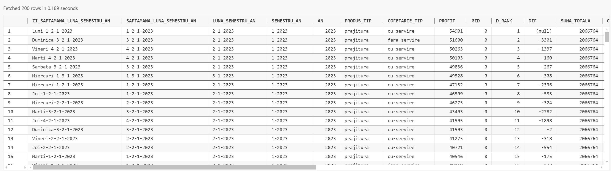
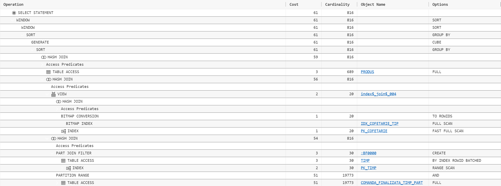


La prima vedere am fi tentați să partiționăm și tabela `TIMP`.

```sql
CREATE TABLE timp_part
        PARTITION BY RANGE (
            id_timp
        )
        ( PARTITION january_2023
            VALUES LESS THAN ( 1675209600000 ),
        PARTITION february_2023
            VALUES LESS THAN ( 1677628800000 ),
        PARTITION march_2023
            VALUES LESS THAN ( 1680307200000 ),
        PARTITION april_2023
            VALUES LESS THAN ( 1682899200000 ),
        PARTITION may_2023
            VALUES LESS THAN ( 1685577600000 ),
        PARTITION june_2023
            VALUES LESS THAN ( 1688169600000 ),
        PARTITION july_2023
            VALUES LESS THAN ( 1690848000000 ),
        PARTITION august_2023
            VALUES LESS THAN ( 1693526400000 ),
        PARTITION september_2023
            VALUES LESS THAN ( 1696118400000 ),
        PARTITION october_2023
            VALUES LESS THAN ( 1698796800000 ),
        PARTITION november_2023
            VALUES LESS THAN ( 1701388800000 ),
        PARTITION december_2023
            VALUES LESS THAN ( 1704067200000 ),
        PARTITION january_2024
            VALUES LESS THAN ( 1706745600000 ),
        PARTITION february_2024
            VALUES LESS THAN ( 1709164800000 ),
        PARTITION march_2024
            VALUES LESS THAN ( 1711843200000 ),
        PARTITION april_2024
            VALUES LESS THAN ( 1714435200000 ),
        PARTITION may_2024
            VALUES LESS THAN ( 1717113600000 ),
        PARTITION june_2024
            VALUES LESS THAN ( 1719705600000 ),
        PARTITION july_2024
            VALUES LESS THAN ( 1722384000000 ),
        PARTITION august_2024
            VALUES LESS THAN ( 1725062400000 ),
        PARTITION september_2024
            VALUES LESS THAN ( 1727654400000 ),
        PARTITION october_2024
            VALUES LESS THAN ( 1730332800000 ),
        PARTITION november_2024
            VALUES LESS THAN ( 1732924800000 ),
        PARTITION december_2024
            VALUES LESS THAN ( 1735603200000 ),
        PARTITION max_partition
            VALUES LESS THAN ( MAXVALUE )
        )
    AS
        SELECT
            *
        FROM
            timp;

ALTER TABLE timp_part
    ADD CONSTRAINT pk_timp_part PRIMARY KEY ( id_timp )
        USING INDEX local
    ENABLE VALIDATE;
```

```sql
SELECT
    t.zi_saptamana_luna_semestru_an,
    t.saptamana_luna_semestru_an,
    t.luna_semestru_an,
    t.semestru_an,
    t.an,
    p.tip                                     AS produs_tip,
    cft.tip                                   AS cofetarie_tip,
    SUM(cf.suma)                              AS profit,
    GROUPING_ID(t.zi_saptamana_luna_semestru_an, t.saptamana_luna_semestru_an, t.luna_semestru_an, t.semestru_an, t.an,
                p.tip, cft.tip)               AS gid,
    DENSE_RANK()
    OVER(PARTITION BY GROUPING_ID(t.zi_saptamana_luna_semestru_an, t.saptamana_luna_semestru_an, t.luna_semestru_an, t.semestru_an, t.an
    ,
                                  p.tip, cft.tip)
         ORDER BY
             SUM(cf.suma) DESC
    )                                         d_rank,
    SUM(cf.suma) - LAG(SUM(cf.suma),
    1)
                   OVER(PARTITION BY GROUPING_ID(t.zi_saptamana_luna_semestru_an, t.saptamana_luna_semestru_an, t.luna_semestru_an, t.semestru_an
                   , t.an,
                                                 p.tip, cft.tip)
                        ORDER BY
                            SUM(cf.suma) DESC
    )                                         AS dif,
    SUM(SUM(cf.suma))
    OVER(PARTITION BY GROUPING_ID(t.zi_saptamana_luna_semestru_an, t.saptamana_luna_semestru_an, t.luna_semestru_an, t.semestru_an, t.an
    ,
                                  p.tip, cft.tip))                  AS suma_totala,
    COUNT(*)
    OVER(PARTITION BY GROUPING_ID(t.zi_saptamana_luna_semestru_an, t.saptamana_luna_semestru_an, t.luna_semestru_an, t.semestru_an, t.an
    ,
                                  p.tip, cft.tip))                  AS cnt,
    RATIO_TO_REPORT(SUM(cf.suma))
    OVER(PARTITION BY GROUPING_ID(t.zi_saptamana_luna_semestru_an, t.saptamana_luna_semestru_an, t.luna_semestru_an, t.semestru_an, t.an
    ,
                                  p.tip, cft.tip))                  AS rtr,
    FIRST_VALUE(SUM(cf.suma))
    OVER(PARTITION BY GROUPING_ID(t.zi_saptamana_luna_semestru_an, t.saptamana_luna_semestru_an, t.luna_semestru_an, t.semestru_an, t.an
    ,
                                  p.tip, cft.tip)
         ORDER BY
             SUM(cf.suma) DESC
    )                                         AS first_val,
    LAST_VALUE(SUM(cf.suma))
    OVER(PARTITION BY GROUPING_ID(t.zi_saptamana_luna_semestru_an, t.saptamana_luna_semestru_an, t.luna_semestru_an, t.semestru_an, t.an
    ,
                                  p.tip, cft.tip)
         ORDER BY
             SUM(cf.suma) DESC
        ROWS BETWEEN UNBOUNDED PRECEDING AND UNBOUNDED FOLLOWING
    )                                         AS last_val,
    CUME_DIST()
    OVER(PARTITION BY GROUPING_ID(t.zi_saptamana_luna_semestru_an, t.saptamana_luna_semestru_an, t.luna_semestru_an, t.semestru_an, t.an
    ,
                                  p.tip, cft.tip)
         ORDER BY
             SUM(cf.suma)
    )                                         AS cume_dist,
    GROUPING(t.zi_saptamana_luna_semestru_an) AS g_zi,
    GROUPING(t.saptamana_luna_semestru_an)    AS g_saptamana,
    GROUPING(t.luna_semestru_an)              AS g_luna,
    GROUPING(t.semestru_an)                   AS g_semestru,
    GROUPING(t.an)                            AS g_an,
    GROUPING(p.tip)                           AS g_produs,
    GROUPING(cft.tip)                         AS g_cofetarie,
    COUNT(*)                                  AS group_cnt
FROM
         comanda_finalizata_timp_part cf
    JOIN timp      t ON t.id_timp = cf.id_timp
    JOIN cofetarie cft ON cft.id_cofetarie = cf.id_cofetarie
    JOIN produs    p ON cf.id_produs = p.id_produs
WHERE
    cf.id_timp BETWEEN 1675209600000 AND 1727654300000
GROUP BY
    CUBE(t.zi_saptamana_luna_semestru_an,
         t.saptamana_luna_semestru_an,
         t.luna_semestru_an,
         t.semestru_an,
         t.an,
         p.tip,
         cft.tip)
ORDER BY
    GROUPING_ID(t.zi_saptamana_luna_semestru_an, t.saptamana_luna_semestru_an, t.luna_semestru_an, t.semestru_an, t.an,
                p.tip, cft.tip);

SELECT
    t.zi_saptamana_luna_semestru_an,
    t.saptamana_luna_semestru_an,
    t.luna_semestru_an,
    t.semestru_an,
    t.an,
    p.tip                                     AS produs_tip,
    cft.tip                                   AS cofetarie_tip,
    SUM(cf.suma)                              AS profit,
    GROUPING_ID(t.zi_saptamana_luna_semestru_an, t.saptamana_luna_semestru_an, t.luna_semestru_an, t.semestru_an, t.an,
                p.tip, cft.tip)               AS gid,
    DENSE_RANK()
    OVER(PARTITION BY GROUPING_ID(t.zi_saptamana_luna_semestru_an, t.saptamana_luna_semestru_an, t.luna_semestru_an, t.semestru_an, t.an
    ,
                                  p.tip, cft.tip)
         ORDER BY
             SUM(cf.suma) DESC
    )                                         d_rank,
    SUM(cf.suma) - LAG(SUM(cf.suma),
    1)
                   OVER(PARTITION BY GROUPING_ID(t.zi_saptamana_luna_semestru_an, t.saptamana_luna_semestru_an, t.luna_semestru_an, t.semestru_an
                   , t.an,
                                                 p.tip, cft.tip)
                        ORDER BY
                            SUM(cf.suma) DESC
    )                                         AS dif,
    SUM(SUM(cf.suma))
    OVER(PARTITION BY GROUPING_ID(t.zi_saptamana_luna_semestru_an, t.saptamana_luna_semestru_an, t.luna_semestru_an, t.semestru_an, t.an
    ,
                                  p.tip, cft.tip))                  AS suma_totala,
    COUNT(*)
    OVER(PARTITION BY GROUPING_ID(t.zi_saptamana_luna_semestru_an, t.saptamana_luna_semestru_an, t.luna_semestru_an, t.semestru_an, t.an
    ,
                                  p.tip, cft.tip))                  AS cnt,
    RATIO_TO_REPORT(SUM(cf.suma))
    OVER(PARTITION BY GROUPING_ID(t.zi_saptamana_luna_semestru_an, t.saptamana_luna_semestru_an, t.luna_semestru_an, t.semestru_an, t.an
    ,
                                  p.tip, cft.tip))                  AS rtr,
    FIRST_VALUE(SUM(cf.suma))
    OVER(PARTITION BY GROUPING_ID(t.zi_saptamana_luna_semestru_an, t.saptamana_luna_semestru_an, t.luna_semestru_an, t.semestru_an, t.an
    ,
                                  p.tip, cft.tip)
         ORDER BY
             SUM(cf.suma) DESC
    )                                         AS first_val,
    LAST_VALUE(SUM(cf.suma))
    OVER(PARTITION BY GROUPING_ID(t.zi_saptamana_luna_semestru_an, t.saptamana_luna_semestru_an, t.luna_semestru_an, t.semestru_an, t.an
    ,
                                  p.tip, cft.tip)
         ORDER BY
             SUM(cf.suma) DESC
        ROWS BETWEEN UNBOUNDED PRECEDING AND UNBOUNDED FOLLOWING
    )                                         AS last_val,
    CUME_DIST()
    OVER(PARTITION BY GROUPING_ID(t.zi_saptamana_luna_semestru_an, t.saptamana_luna_semestru_an, t.luna_semestru_an, t.semestru_an, t.an
    ,
                                  p.tip, cft.tip)
         ORDER BY
             SUM(cf.suma)
    )                                         AS cume_dist,
    GROUPING(t.zi_saptamana_luna_semestru_an) AS g_zi,
    GROUPING(t.saptamana_luna_semestru_an)    AS g_saptamana,
    GROUPING(t.luna_semestru_an)              AS g_luna,
    GROUPING(t.semestru_an)                   AS g_semestru,
    GROUPING(t.an)                            AS g_an,
    GROUPING(p.tip)                           AS g_produs,
    GROUPING(cft.tip)                         AS g_cofetarie,
    COUNT(*)                                  AS group_cnt
FROM
         comanda_finalizata_timp_part cf
    JOIN timp_part t ON t.id_timp = cf.id_timp
    JOIN cofetarie cft ON cft.id_cofetarie = cf.id_cofetarie
    JOIN produs    p ON cf.id_produs = p.id_produs
WHERE
    cf.id_timp BETWEEN 1675209600000 AND 1727654300000
GROUP BY
    CUBE(t.zi_saptamana_luna_semestru_an,
         t.saptamana_luna_semestru_an,
         t.luna_semestru_an,
         t.semestru_an,
         t.an,
         p.tip,
         cft.tip)
ORDER BY
    GROUPING_ID(t.zi_saptamana_luna_semestru_an, t.saptamana_luna_semestru_an, t.luna_semestru_an, t.semestru_an, t.an,
                p.tip, cft.tip);
```

Utilizând partiționarea, observăm un cost de **17834**. Încercând fără partiționare, obținem un cost de **17799**. Acest lucru demonstrează că partiționarea timpului nu aduce beneficii în acest caz, ci, dimpotrivă, costul crește. Deși aceste costuri pot părea la fel, overhead-ul este mai mare în cazul partitonării timpului și nejustificat, fiind o tabelă mică. Așadar, se dovedește că partiționarea timpului poate fi inutilă în situații similare, exemple ilustrative fiind:

```sql
--cost 3
SELECT
   *
FROM
   timp
WHERE
   id_timp BETWEEN 1675209600000 AND 1677628800000;

-- cost 2
SELECT
   *
FROM
   timp_part
WHERE
   id_timp BETWEEN 1675209600000 AND 1677628800000;

--cost 7
SELECT
   *
FROM
   timp
WHERE
   id_timp BETWEEN 1675209600000 AND 1711843200000;

-- cost 22
SELECT
   *
FROM
   timp_part
WHERE
   id_timp BETWEEN 1675209600000 AND 1711843200000;
```

### 9. Optimizarea unei cereri

Dorim să obținem suma, media, numărul de comenzi, rangul, rația de încasare și diferența în scară.

```sql
SELECT
  p.tip AS tip_produs,
  c.tip AS tip_cofetarie,
  SUM(cf.suma) AS suma,
  COUNT(*) AS nr_comenzi,
  AVG(cf.suma) AS medie,
  DENSE_RANK() OVER (
    ORDER BY
      SUM(cf.suma) desc
  ) AS rank_desc_nr_comenzi,
  ratio_to_report (SUM(cf.suma)) OVER () AS rtr_suma,
  SUM(cf.suma) - lag (SUM(cf.suma), 1, SUM(cf.suma)) OVER (
    ORDER BY
      SUM(cf.suma) desc
  ) AS dif_lag_suma
FROM
  comanda_finalizata cf
  JOIN produs p ON cf.id_produs = p.id_produs
  JOIN cofetarie c ON cf.id_cofetarie = c.id_cofetarie
GROUP BY
  p.tip,
  c.tip;
```

În continuare ne propunem să optimizăm cererea, folosind următoarele tehnici specifice bazelor de date depozit:

- partiționare;
- indecși bitmap join;
- vizualizări materializate.

<!-- partitionarea -->

#### Partiționarea

În cazul de față, prin lipsa filtrării după timp/listă de valori, nu există o justificare pentru partitonarea pe tabela de fapte. Din aceleași considerente, precum și cardinalitatea redusă a tabelelor dimensiune, partiționarea acestora ar fi o eroare de proiectare.

#### Indecși bitmap join

Intrucat ne intereseaza tipul din fiecare tabel dimensiune, iar acest tip are o cardinaliatate relativa mica la tabele, un index bitmap join ar putea fi o solutie viabila pentru a imbunatati performanta query-ului. O limitare este, in schimb faptul ca nu dorim limitarea tipului cofetariei sau a produsului in query-ul nostru, asadar un index bitmap join nu ar putea fi o solutie viabila in cazul de fata. Pentru a ne convinge de incompatibilitatea acestei metode, urmează să efectuăm o serie de teste.

Vom începe cu crearea indecșilor necesari query-ului:

```sql
CREATE bitmap index bji_cf_produs_tip ON comanda_finalizata (p.tip)
FROM
 comanda_finalizata cf,
 produs p
WHERE
 cf.id_produs = p.id_produs;

CREATE bitmap index bji_cf_cofetarie_tip ON comanda_finalizata (c.tip)
FROM
 comanda_finalizata cf,
 cofetarie c
WHERE
 cf.id_cofetarie = c.id_cofetarie;
```

La rularea cererii fără hint-uri, optimizatorul **_Oracle_** nu folosește indecșii de mai sus, având un cost de **_957_**.

```sql
SELECT
 /*+ INDEX(cf bji_cf_cofetarie_tip)*/
 p.tip AS tip_produs,
 c.tip AS tip_cofetarie,
 SUM(cf.suma) AS suma,
 COUNT(*) AS nr_comenzi,
 AVG(cf.suma) AS medie,
 DENSE_RANK() OVER (
   ORDER BY
     SUM(cf.suma) desc
 ) AS rank_desc_nr_comenzi,
 ratio_to_report (SUM(cf.suma)) OVER () AS rtr_suma,
 SUM(cf.suma) - lag (SUM(cf.suma), 1, SUM(cf.suma)) OVER (
   ORDER BY
     SUM(cf.suma) desc
 ) AS dif_lag_suma
FROM
 comanda_finalizata cf
 JOIN produs p ON cf.id_produs = p.id_produs
 JOIN cofetarie c ON cf.id_cofetarie = c.id_cofetarie
GROUP BY
 p.tip,
 c.tip;

SELECT
 /*+ INDEX(cf bji_cf_produs_tip)*/
 p.tip AS tip_produs,
 c.tip AS tip_cofetarie,
 SUM(cf.suma) AS suma,
 COUNT(*) AS nr_comenzi,
 AVG(cf.suma) AS medie,
 DENSE_RANK() OVER (
   ORDER BY
     SUM(cf.suma) desc
 ) AS rank_desc_nr_comenzi,
 ratio_to_report (SUM(cf.suma)) OVER () AS rtr_suma,
 SUM(cf.suma) - lag (SUM(cf.suma), 1, SUM(cf.suma)) OVER (
   ORDER BY
     SUM(cf.suma) desc
 ) AS dif_lag_suma
FROM
 comanda_finalizata cf
 JOIN produs p ON cf.id_produs = p.id_produs
 JOIN cofetarie c ON cf.id_cofetarie = c.id_cofetarie
GROUP BY
 p.tip,
 c.tip;
```

Forțând pe rând incecșii, obținem costuri de peste 5000, așadar putem conclude discrepanța dintre această metodă de optimizare și structura interogării noastre. Acest fapt se datorează și celor antemenționate, mai precis lipsa filtrării după tipuri, dar și a tabelelor dimensiune de cardinalitate mică. Tabela de fapte, având o cardinalitate mare, utilizând acești indecși, motorul sql trebuie să convertească pe rând numărul mare de linii din bitmap in ROWID, iar citirea acestora se va face independent (random IO) în loc de scanarea secvențială a unui full table scan normal.

#### Vizualizare materializată

În cazul de față, o vizualizare materializată ar putea fi soluție viabilă pentru a îmbunătăți performanța. Având un query de bază fără filtrări și cu o agregare relativ simplă, o astfel de soluție pare a fi cea mai bună abordare. Această vizualizare ar putea fi folosită și pentru alte queryuri adiționale care ar realiza filtrări ulterioare. Așadar, vom crea un view materializat pentru query-ul de mai sus.
Pentru a face rescrierea querry-urilor să accepte constrângeri bazate pe rely vom seta parametrul:

```sql
ALTER session
SET
    query_rewrite_integrity = trusted;
```

Crearea propriu-zisă:

```sql
CREATE materialized view vm_cf_prod_cof_8 build immediate refresh complete enable query rewrite AS
SELECT
    p.tip AS tip_produs,
    c.tip AS tip_cofetarie,
    SUM(cf.suma) AS suma,
    COUNT(*) AS nr_comenzi,
    AVG(cf.suma) AS medie,
    DENSE_RANK() OVER (
        ORDER BY
            SUM(cf.suma) desc
    ) AS rank_desc_nr_comenzi,
    ratio_to_report (SUM(cf.suma)) OVER () AS rtr_suma,
    SUM(cf.suma) - lag (SUM(cf.suma), 1, SUM(cf.suma)) OVER (
        ORDER BY
            SUM(cf.suma) desc
    ) AS dif_lag_suma
FROM
    comanda_finalizata cf
    JOIN produs p ON cf.id_produs = p.id_produs
    JOIN cofetarie c ON cf.id_cofetarie = c.id_cofetarie
GROUP BY
    p.tip,
    c.tip;
```

Pentru a avea controlul complet asupra reactualizării view-ului vom apela manual procedura:

```sql
EXEC DBMS_MVIEW.REFRESH('vm_cf_prod_cof_8', 'C');
```

Pentru a demonstra că vizualizarea materializată permite rescrierea cererilor, vom rula efectiv cererea de la crearea acestuia.

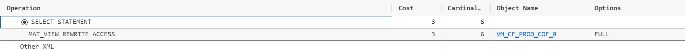

În continuare, dorim să interogăm filtrat statisticile obținute anterior și vom arăta cum ajungem la o rescriere eficientă a acestui query. Pentru filtrare vom dori înregistrările care au suma mai mare ca $10^7$, iar numărul de comenzi mai mare decât $10^4$.

O tehnică imediată pentru a obține cele dorite constă în filtrarea directă în query-ul de bază:

```sql
SELECT
    p.tip AS tip_produs,
    c.tip AS tip_cofetarie,
    SUM(cf.suma) AS suma,
    COUNT(*) AS nr_comenzi,
    AVG(cf.suma) AS medie,
    DENSE_RANK() OVER (
        ORDER BY
            SUM(cf.suma) desc
    ) AS rank_desc_nr_comenzi,
    ratio_to_report (SUM(cf.suma)) OVER () AS rtr_suma,
    SUM(cf.suma) - lag (SUM(cf.suma), 1, SUM(cf.suma)) OVER (
        ORDER BY
            SUM(cf.suma) desc
    ) AS dif_lag_suma
FROM
    comanda_finalizata cf
    JOIN produs p ON cf.id_produs = p.id_produs
    JOIN cofetarie c ON cf.id_cofetarie = c.id_cofetarie
GROUP BY
    p.tip,
    c.tip
HAVING
    SUM(cf.suma) > 1000000
    AND COUNT(*) > 10000;
```

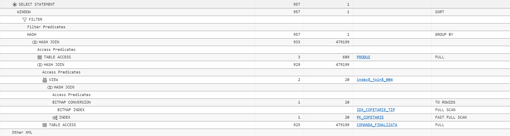

Contrar așteptărilor, după analiza planului de execuție rămânem perplecși și observăm că optimizatorul nu a ales să meargă pe view-ul materializat, în schimb a rerulat integral cererea originală, făcând un hash join între comanda_finalizată și cofetărie, urmat de un hash join cu produsul, iar la final filtrarea. Vom încerca forțarea optimizatorului pentru a utiliza vizualizarea materializată dându-i hint-ul: `/*+ REWRITE(vm_cf_prod_cof_8) */`

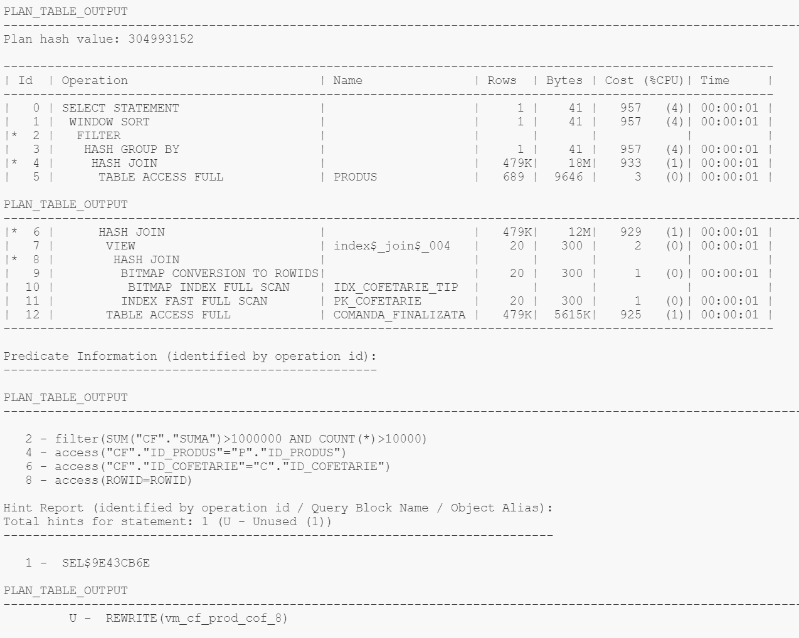

Uitându-ne pe noul plan de execuție, vom observa că optimizatorul a văzut hint-ul, dar nu l-a folosit. Vom recurge la o altă încercare de a forța utilizarea vizualizării materializate, adică de a rescrie cererea astfel încât să utilizăm un subquery, după care pe acesta să facem filtrarea:

```sql
SELECT
    *
FROM
    (
        SELECT
            p.tip AS tip_produs,
            c.tip AS tip_cofetarie,
            SUM(cf.suma) AS suma,
            COUNT(*) AS nr_comenzi,
            AVG(cf.suma) AS medie,
            DENSE_RANK() OVER (
                ORDER BY
                    SUM(cf.suma) desc
            ) AS rank_desc_nr_comenzi,
            ratio_to_report (SUM(cf.suma)) OVER () AS rtr_suma,
            SUM(cf.suma) - lag (SUM(cf.suma), 1, SUM(cf.suma)) OVER (
                ORDER BY
                    SUM(cf.suma) desc
            ) AS dif_lag_suma
        FROM
            comanda_finalizata cf
            JOIN produs p ON cf.id_produs = p.id_produs
            JOIN cofetarie c ON cf.id_cofetarie = c.id_cofetarie
        GROUP BY
            p.tip,
            c.tip
    )
WHERE
    suma > 1000000
    AND nr_comenzi > 10000;
```

Rulând această interogare, vedem cu stupoare același rezultat în planul de execuție, adică optimizatorul nu a folosit vizualizarea. Analog cu cererea de mai sus, dacă vom utiliza hint-ul vom fi ignorați.

În bătălia noastră continuă cu optimizatorul mai avem o micunealtă secretă, anume **CTE**. În cazul de față, diferența principală între metodele de mai sus și **CTE** este reprezantată de faptul că cel din urmă este evaluat `independent` de query-ul principal și materializat la nevoie în memorie pentru a fi utilizat în cerere. Așadar, vom augumenta cererea creând un **CTE** care reprezintă exact cererea din crearea vizualizării:

```sql
WITH
    cte AS (
        SELECT
            p.tip AS tip_produs,
            c.tip AS tip_cofetarie,
            SUM(cf.suma) AS suma,
            COUNT(*) AS nr_comenzi,
            AVG(cf.suma) AS medie,
            DENSE_RANK() OVER (
                ORDER BY
                    SUM(cf.suma) desc
            ) AS rank_desc_nr_comenzi,
            ratio_to_report (SUM(cf.suma)) OVER () AS rtr_suma,
            SUM(cf.suma) - lag (SUM(cf.suma), 1, SUM(cf.suma)) OVER (
                ORDER BY
                    SUM(cf.suma) desc
            ) AS dif_lag_suma
        FROM
            comanda_finalizata cf
            JOIN produs p ON cf.id_produs = p.id_produs
            JOIN cofetarie c ON cf.id_cofetarie = c.id_cofetarie
        GROUP BY
            p.tip,
            c.tip
    )
SELECT
    *
FROM
    cte
WHERE
    suma > 1000000
    AND nr_comenzi > 10000;
```

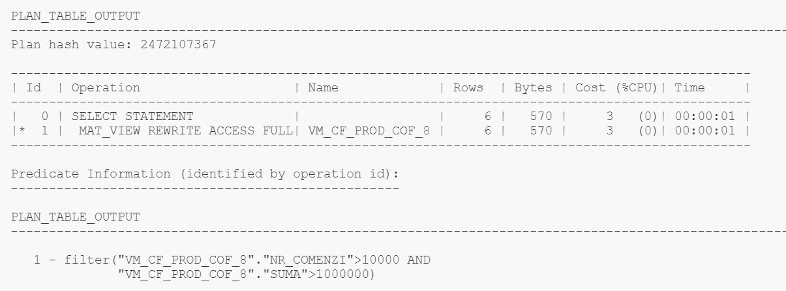

Printre lacrimile de fericire, când ne uităm la planul de execuție, observăm că optimizatorul a folosit **CTE**-ul și implicit vizualizarea materializată. Planul de execuție constă doar dintr-un select și o filtrare, Oracle îmbunătățește cererea necreând în memorie **CTE**-ul și utilizând direct vizualizarea. Această putere nou dobândită de optimizator face eșecurile cererilor anterioare și mai ambigue. Singurul motiv pentru care intuim că optimizatorul a folosit vizualizarea într-un final este independența **CTE**-ului, astfel ușurând identificarea corelației dintre query și vizualizare.

Pentru a arăta un plan de execuție în care se materializează în memorie **CTE**-urile vom crea un query demonstrativ:

```sql
WITH
    cte AS (
        SELECT
            p.tip AS tip_produs,
            c.tip AS tip_cofetarie,
            SUM(cf.suma) AS suma,
            COUNT(*) AS nr_comenzi,
            AVG(cf.suma) AS medie,
            DENSE_RANK() OVER (
                ORDER BY
                    SUM(cf.suma) desc
            ) AS rank_desc_nr_comenzi,
            ratio_to_report (SUM(cf.suma)) OVER () AS rtr_suma,
            SUM(cf.suma) - lag (SUM(cf.suma), 1, SUM(cf.suma)) OVER (
                ORDER BY
                    SUM(cf.suma) desc
            ) AS dif_lag_suma
        FROM
            comanda_finalizata cf
            JOIN produs p ON cf.id_produs = p.id_produs
            JOIN cofetarie c ON cf.id_cofetarie = c.id_cofetarie
        GROUP BY
            p.tip,
            c.tip
    )
SELECT
    *
FROM
    cte c1
    JOIN cte c2 ON c1.tip_produs = c2.tip_produs
WHERE
    c1.suma > 1000000
    AND c2.nr_comenzi > 10000;
```

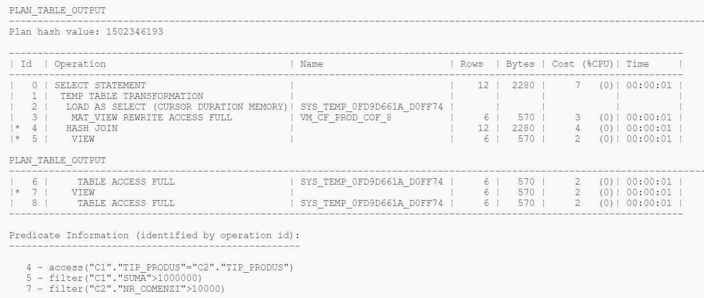

Analizând acest plan de execuție se poate observa cum s-au încărcat într-un tabel temporar cu prefix-ul `SYS_TEMP` rezultatele din vizualizare.

### 10. Interogari avansate specifice bazelor de date depozit

#### 10.1 Să se afle statisticle pentru pozițiile curente ale cofetarilor din fiecare cofetărie

```sql
SELECT
    i.id_cofetarie,
    COUNT(*) AS cnt,
    AVG(i.salariu) AS salariu_mediu,
    SUM(i.salariu) AS salariu_total,
    MAX(i.salariu) AS salariu_maxim,
    MIN(i.salariu) AS salariu_minim,
    DENSE_RANK() OVER (
        ORDER BY
            AVG(i.salariu) desc
    ) AS rang_salariu_mediu_desc_cofetarie
FROM
    informatii_angajat i
    JOIN istoric_angajat a ON i.id_istoric = a.id_istoric
    JOIN timp ts ON i.id_timp_start = ts.id_timp
    LEFT JOIN timp tf ON i.id_timp_final = tf.id_timp
WHERE
    tf.id_timp IS NULL
    AND a.tip_angajat = 'cofetar'
GROUP BY
    i.id_cofetarie;
```

Output:

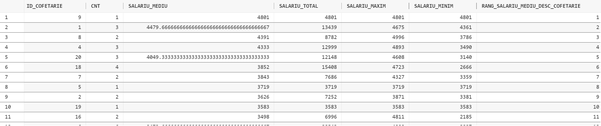

Plan de execuție:

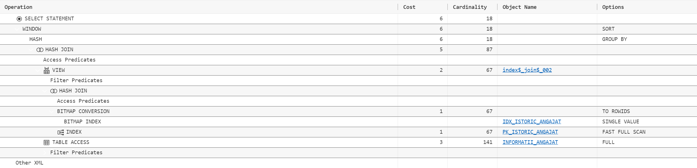

#### 10.2 Să se compare salariile curente și cele istorice pentru: (tip angajat, an start, tip cofetarie), (tip angajat, tip cofetarie), (tip angajat, an start), (tip cofetarie), (tip angajat), (an start), (per total).

```sql
WITH
    data_status_cte AS (
        SELECT
            a.id_angajat,
            i.id_timp_final,
            a.tip_angajat,
            ts.an AS an_start,
            c.tip AS tip_cofetarie,
            CASE
                WHEN i.id_timp_final IS NULL THEN 'cur'
                ELSE 'historical'
            END AS data_status,
            i.salariu
        FROM
            informatii_angajat i
            JOIN istoric_angajat a ON i.id_istoric = a.id_istoric
            JOIN timp ts ON i.id_timp_start = ts.id_timp
            JOIN cofetarie c ON i.id_cofetarie = c.id_cofetarie
    )
SELECT
    COALESCE(to_char (an_start), 'ALL YEARS') AS an_start,
    COALESCE(tip_angajat, 'ALL TYPES') AS tip_angajat,
    COALESCE(tip_cofetarie, 'ALL CATEGORIES') AS tip_cofetarie,
    MAX(
        CASE
            WHEN data_status = 'cur' THEN salariu_mediu
        END
    ) AS salariu_mediu_curent,
    MAX(
        CASE
            WHEN data_status = 'historical' THEN salariu_mediu
        END
    ) AS salariu_mediu_istoric,
    MAX(
        CASE
            WHEN data_status = 'cur' THEN salariu_total
        END
    ) AS salariu_total_curent,
    MAX(
        CASE
            WHEN data_status = 'historical' THEN salariu_total
        END
    ) AS salariu_total_istoric,
    MAX(
        CASE
            WHEN data_status = 'cur' THEN salariu_maxim
        END
    ) AS salariu_maxim_curent,
    MAX(
        CASE
            WHEN data_status = 'historical' THEN salariu_maxim
        END
    ) AS salariu_maxim_istoric,
    MAX(
        CASE
            WHEN data_status = 'cur' THEN salariu_minim
        END
    ) AS salariu_minim_curent,
    MAX(
        CASE
            WHEN data_status = 'historical' THEN salariu_minim
        END
    ) AS salariu_minim_istoric,
    DENSE_RANK() OVER (
        PARTITION BY
            grouping_id (tip_angajat, an_start, tip_cofetarie)
        ORDER BY
            MAX(
                CASE
                    WHEN data_status = 'cur' THEN salariu_mediu
                END
            ) desc
    ) AS rank_curr,
    DENSE_RANK() OVER (
        PARTITION BY
            grouping_id (tip_angajat, an_start, tip_cofetarie)
        ORDER BY
            MAX(
                CASE
                    WHEN data_status = 'historical' THEN salariu_mediu
                END
            ) desc
    ) AS rank_hist,
    ratio_to_report (
        MAX(
            CASE
                WHEN data_status = 'cur' THEN salariu_mediu
            END
        )
    ) OVER (
        PARTITION BY
            grouping_id (tip_angajat, an_start, tip_cofetarie)
    ) AS ratio_cur,
    ratio_to_report (
        MAX(
            CASE
                WHEN data_status = 'historical' THEN salariu_mediu
            END
        )
    ) OVER (
        PARTITION BY
            grouping_id (tip_angajat, an_start, tip_cofetarie)
    ) AS ratio_hist
FROM
    (
        SELECT
            tip_angajat,
            an_start,
            tip_cofetarie,
            data_status,
            AVG(salariu) AS salariu_mediu,
            SUM(salariu) AS salariu_total,
            MAX(salariu) AS salariu_maxim,
            MIN(salariu) AS salariu_minim
        FROM
            data_status_cte
        GROUP BY
            tip_angajat,
            an_start,
            tip_cofetarie,
            data_status
    ) salary_data
GROUP BY
    GROUPING sets (
        (tip_angajat, an_start, tip_cofetarie),
        (tip_angajat, tip_cofetarie),
        (tip_angajat, an_start),
        (tip_cofetarie),
        (tip_angajat),
        (an_start),
        ()
    )
ORDER BY
    an_start,
    tip_angajat,
    tip_cofetarie,
    rank_curr;
```

Output:

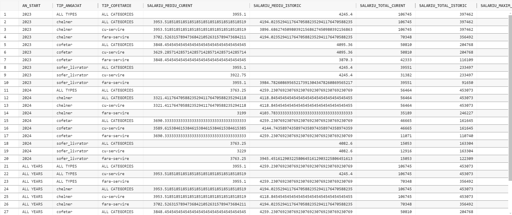

#### 10.3 Să se afle numărul de comenzi, suma totală și data de încasare într-un interval specificat pentru fiecare: (tip de plată, oraș), (tip de plată, județ), (tip de plată, zonă), (tip de plată), (per total)

```sql
SELECT
    p.tip,
    l.nume_zona,
    l.nume_judet,
    l.nume_oras_judet,
    COUNT(*) AS cnt,
    SUM(i.suma_incasare) AS suma_incasare,
    SUM(i.suma_total_comanda) / SUM(i.suma_incasare) AS rata_incasare,
    grouping_id (p.tip) gr_p_tip,
    grouping_id (l.nume_zona) gr_l_nume_zona,
    grouping_id (l.nume_judet) gr_l_nume_judet,
    grouping_id (l.nume_oras_judet) gr_l_nume_oras_judet,
    DENSE_RANK() OVER (
        PARTITION BY
            grouping_id (
                p.tip,
                l.nume_zona,
                l.nume_judet,
                l.nume_oras_judet
            )
        ORDER BY
            COUNT(*) desc
    ) AS rank_desc_cnt_tip_locatie,
    DENSE_RANK() OVER (
        PARTITION BY
            grouping_id (l.nume_zona, l.nume_judet, l.nume_oras_judet)
        ORDER BY
            COUNT(*) desc
    ) AS rank_desc_cnt_locatie,
    DENSE_RANK() OVER (
        PARTITION BY
            grouping_id (
                p.tip,
                l.nume_zona,
                l.nume_judet,
                l.nume_oras_judet
            )
        ORDER BY
            SUM(i.suma_incasare) desc
    ) AS rank_desc_suma_incasare_tip_locatie,
    DENSE_RANK() OVER (
        PARTITION BY
            grouping_id (l.nume_zona, l.nume_judet, l.nume_oras_judet)
        ORDER BY
            SUM(i.suma_incasare) desc
    ) AS rank_desc_suma_incasare_locatie,
    ratio_to_report (COUNT(*)) OVER (
        PARTITION BY
            grouping_id (
                p.tip,
                l.nume_zona,
                l.nume_judet,
                l.nume_oras_judet
            )
    ) AS rtr_cnt_tip_locatie,
    ratio_to_report (COUNT(*)) OVER (
        PARTITION BY
            grouping_id (l.nume_zona, l.nume_judet, l.nume_oras_judet)
    ) AS rtr_cnt_locatie,
    ratio_to_report (SUM(i.suma_incasare)) OVER (
        PARTITION BY
            grouping_id (
                p.tip,
                l.nume_zona,
                l.nume_judet,
                l.nume_oras_judet
            )
    ) AS rtr_suma_incasare_tip_locatie,
    ratio_to_report (SUM(i.suma_incasare)) OVER (
        PARTITION BY
            grouping_id (l.nume_zona, l.nume_judet, l.nume_oras_judet)
    ) AS rtr_suma_incasare_locatie
FROM
    incasare_timp_part i
    JOIN plata p ON i.id_incasare = p.id_plata
    JOIN locatie l ON i.id_locatie = l.id_locatie
    JOIN timp t ON i.id_timp = t.id_timp
WHERE
    t.id_timp BETWEEN 1675209600000 AND 1677628800000
GROUP BY
    ROLLUP (
        p.tip,
        l.nume_zona,
        l.nume_judet,
        l.nume_oras_judet
    );
```

Output:

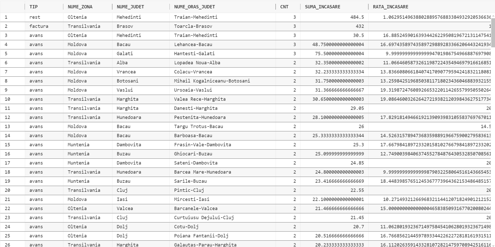

#### 10.4 Să se afle clienții cu cele mai multe cumpărături din fiecare cofetărie cu servire și per total din cofetăriile cu servire într-un interval de timp specificat

```sql
SELECT
    c.id_client,
    cft.id_cofetarie,
    MAX(c.nume)    AS nume,
    MAX(c.prenume) AS prenume,
    MAX(cft.tip)   AS cofetarie_tip,
    COUNT(*)       nr_comenzi,
    SUM(cf.suma)   suma_totala,
    DENSE_RANK()
    OVER(PARTITION BY GROUPING_ID(cft.id_cofetarie, c.id_client)
         ORDER BY
             SUM(cf.suma) DESC
    )              d_rank,
    SUM(cf.suma) - LEAD(SUM(cf.suma),
     1)
                   OVER(PARTITION BY GROUPING_ID(cft.id_cofetarie, c.id_client)
                        ORDER BY
                            SUM(cf.suma) DESC
    )              AS dif,
    RATIO_TO_REPORT(SUM(cf.suma))
    OVER()         AS rtr
FROM
         comanda_finalizata_timp_part cf
    JOIN client    c ON cf.id_client = c.id_client
    JOIN cofetarie cft ON cf.id_cofetarie = cft.id_cofetarie
WHERE
    cf.id_timp BETWEEN 1675209600000 AND 1677628800000
    AND cft.tip = 'cu-servire'
GROUP BY
    GROUPING SETS ( c.id_client, ( c.id_client,
                                   cft.id_cofetarie ) );
```

Output:

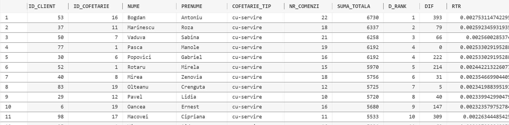

Plan de execuție:

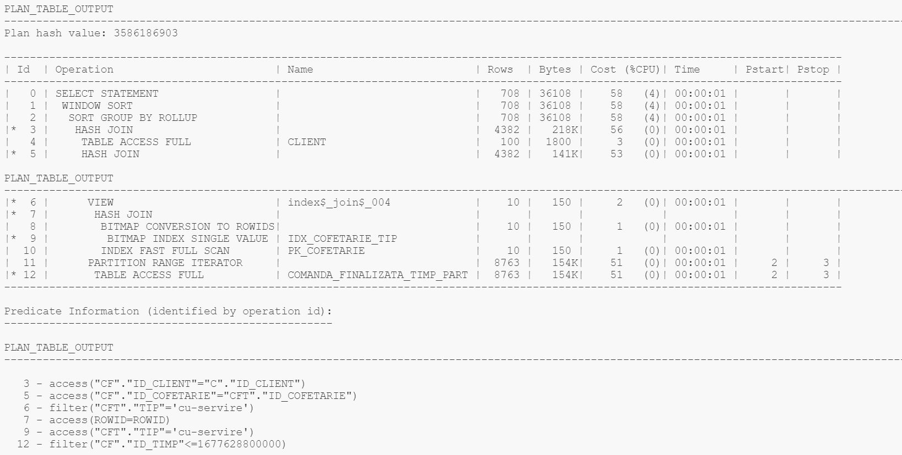

#### 10.5 Să se afle cele mai vândute produse în funcție de: (tip produs, tip cofetarie, oraș), (tip produs, tip cofetărie), (tip produs, oraș), (tip produs)

```sql
SELECT
    p.tip AS tip_produs,
    c.tip AS tip_cofetarie,
    l.nume_oras_judet AS oras,
    grouping_id (p.tip, c.tip, l.nume_oras_judet) AS grupare,
    SUM(cf.suma) AS suma,
    COUNT(*) AS nr_comenzi,
    AVG(cf.suma) AS medie,
    DENSE_RANK() OVER (
        PARTITION BY
            grouping_id (p.tip, c.tip, l.nume_oras_judet)
        ORDER BY
            SUM(cf.suma) desc
    ) d_rank,
    SUM(cf.suma) - lead (SUM(cf.suma), 1) OVER (
        PARTITION BY
            grouping_id (p.tip, c.tip, l.nume_oras_judet)
        ORDER BY
            SUM(cf.suma) desc
    ) AS dif,
    ratio_to_report (SUM(cf.suma)) OVER (
        PARTITION BY
            grouping_id (p.tip, c.tip, l.nume_oras_judet)
    ) AS rtr
FROM
    comanda_finalizata cf
    JOIN produs p ON cf.id_produs = p.id_produs
    JOIN cofetarie c ON cf.id_cofetarie = c.id_cofetarie
    JOIN locatie l ON cf.id_locatie = l.id_locatie
GROUP BY
    GROUPING sets (
        (p.tip, c.tip, l.nume_oras_judet),
        (p.tip, c.tip),
        (p.tip, l.nume_oras_judet),
        (p.tip)
    );
```

Output:

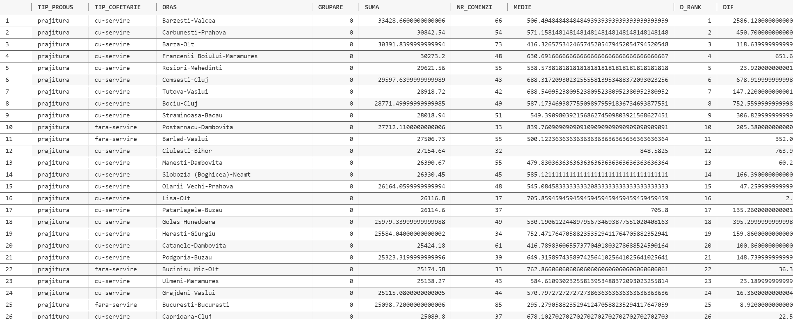

#### 10.6 Să se compare profitul comenzilor cu discount și fără discount pe: (lună), (lună, tip produs), (lună, tip cofetărie)

```sql
WITH
    cmd AS (
        SELECT
            id_comanda,
            MAX(discount) AS discount
        FROM
            comanda_finalizata
        GROUP BY
            id_comanda
    )
SELECT
    t.luna_semestru_an,
    c.tip AS tip_cofetarie,
    p.tip AS tip_produs,
    MAX(t.luna_nume) AS luna_nume,
    COUNT(
        DISTINCT CASE
            WHEN cmd.discount IS NULL THEN cf.id_comanda
        END
    ) AS nr_comenzi_fara_discount,
    COUNT(
        DISTINCT CASE
            WHEN cmd.discount IS NOT NULL THEN cf.id_comanda
        END
    ) AS nr_comenzi_cu_discount,
    SUM(
        CASE
            WHEN cmd.discount IS NULL THEN cf.pret_cantitate_discount_produs
            ELSE 0
        END
    ) AS suma_fara_discount,
    SUM(
        CASE
            WHEN cmd.discount IS NOT NULL THEN cf.pret_cantitate_discount_produs
            ELSE 0
        END
    ) AS suma_cu_discount,
    SUM(cf.pret_cantitate_discount_produs) AS suma_totala,
    DENSE_RANK() OVER (
        PARTITION BY
            grouping_id (t.luna_semestru_an, p.tip, c.tip)
        ORDER BY
            SUM(
                CASE
                    WHEN cmd.discount IS NULL THEN cf.pret_cantitate_discount_produs
                    ELSE 0
                END
            ) desc
    ) AS rang_fara_discount,
    SUM(
        CASE
            WHEN cmd.discount IS NULL THEN cf.pret_cantitate_discount_produs
            ELSE 0
        END
    ) - SUM(
        CASE
            WHEN cmd.discount IS NOT NULL THEN cf.pret_cantitate_discount_produs
            ELSE 0
        END
    ) AS dif_fara_cu_discount,
    COUNT(
        DISTINCT CASE
            WHEN cmd.discount IS NULL THEN cf.id_comanda
        END
    ) - COUNT(
        DISTINCT CASE
            WHEN cmd.discount IS NOT NULL THEN cf.id_comanda
        END
    ) AS dif_nr_comenzi_fara_cu_discount,
    DENSE_RANK() OVER (
        PARTITION BY
            grouping_id (t.luna_semestru_an, p.tip, c.tip)
        ORDER BY
            SUM(
                CASE
                    WHEN cmd.discount IS NOT NULL THEN cf.pret_cantitate_discount_produs
                    ELSE 0
                END
            ) desc
    ) AS rang_cu_discount,
    SUM(
        CASE
            WHEN cmd.discount IS NULL THEN cf.pret_cantitate_discount_produs
        END
    ) / COUNT(
        DISTINCT CASE
            WHEN cmd.discount IS NULL THEN cf.id_comanda
        END
    ) AS medie_fara_discount,
    SUM(
        CASE
            WHEN cmd.discount IS NOT NULL THEN cf.pret_cantitate_discount_produs
        END
    ) / COUNT(
        DISTINCT CASE
            WHEN cmd.discount IS NOT NULL THEN cf.id_comanda
        END
    ) AS medie_cu_discount,
    grouping_id (t.luna_semestru_an, p.tip, c.tip) AS grupare,
    grouping_id (t.luna_semestru_an) AS grupare_luna,
    grouping_id (p.tip) AS grupare_produs,
    grouping_id (c.tip) AS grupare_cofetarie
FROM
    comanda_finalizata cf
    JOIN produs p ON cf.id_produs = p.id_produs
    JOIN cofetarie c ON cf.id_cofetarie = c.id_cofetarie
    JOIN timp t ON cf.id_timp = t.id_timp
    JOIN cmd ON cf.id_comanda = cmd.id_comanda
GROUP BY
    GROUPING sets (
        t.luna_semestru_an,
        (t.luna_semestru_an, p.tip),
        (t.luna_semestru_an, c.tip)
    );

```

Output:

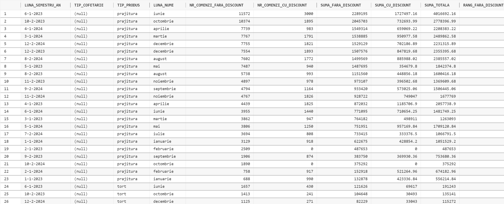

#### 10.7 Să se afle cele mai vândute sucuri din fiecare semestru

```sql
SELECT
    p.id_produs,
    t.semestru_an,
    COUNT(*) AS nr_comenzi,
    SUM(cf.suma) AS suma_totala,
    DENSE_RANK() OVER (
        PARTITION BY
            t.semestru_an
        ORDER BY
            SUM(cf.suma) desc
    ) AS rang_sem,
    ratio_to_report (SUM(cf.suma)) OVER (
        PARTITION BY
            t.semestru_an
    ) AS rtr_sem
FROM
    comanda_finalizata cf
    JOIN produs p ON cf.id_produs = p.id_produs
    JOIN timp t ON cf.id_timp = t.id_timp
WHERE
    p.tip = 'suc'
GROUP BY
    t.semestru_an,
    p.id_produs;
```

Output:

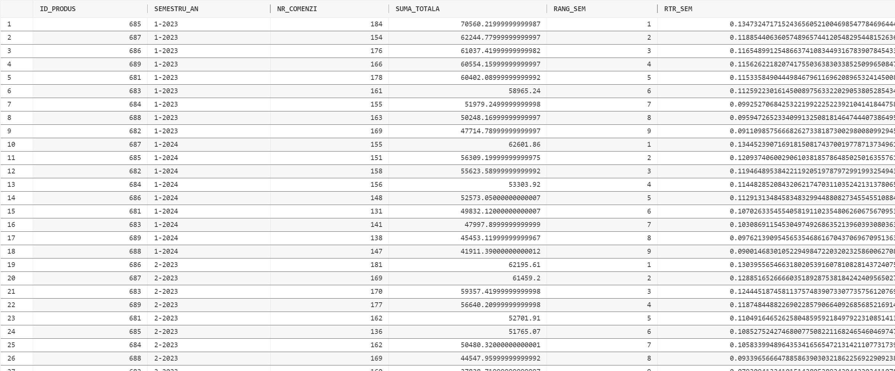

Plan de execuție:

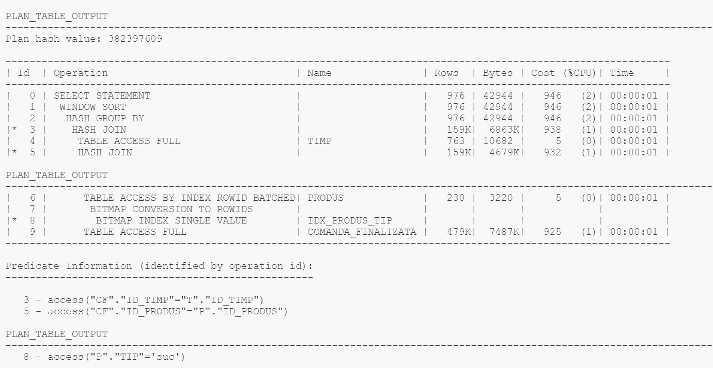

#### 10.8 Să se afle profitabilitatea tipurilor de cofetării într-un interval de timp specificat

```sql
SELECT
    c.tip,
    SUM(cf.suma) AS suma_totala,
    DENSE_RANK() OVER (
        ORDER BY
            SUM(cf.suma) desc
    ) AS rang,
    ratio_to_report (SUM(cf.suma)) OVER () AS rtr,
    COUNT(*) AS nr_comenzi,
    SUM(cf.suma) - lead (SUM(cf.suma), 1) OVER (
        ORDER BY
            SUM(cf.suma) desc
    ) AS dif
FROM
    comanda_finalizata_timp_part cf
    JOIN cofetarie c ON cf.id_cofetarie = c.id_cofetarie
    JOIN timp t ON cf.id_timp = t.id_timp
WHERE
    t.id_timp BETWEEN 1675209600000 AND 1677628800000
GROUP BY
    c.tip;
```

Output:

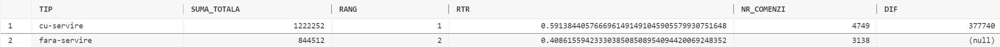

#### 10.9 Să se afle statisticile pentru fiecare tip de plată într-un interval specificat

```sql
SELECT
    p.tip,
    SUM(i.suma_incasare) AS suma_totala,
    DENSE_RANK() OVER (
        ORDER BY
            SUM(i.suma_incasare) desc
    ) AS rang,
    ratio_to_report (SUM(i.suma_incasare)) OVER () AS rtr,
    COUNT(*) AS nr_comenzi,
    SUM(i.suma_incasare) - lead (SUM(i.suma_incasare), 1) OVER (
        ORDER BY
            SUM(i.suma_incasare) desc
    ) AS dif
FROM
    incasare_timp_part i
    JOIN plata p ON i.id_incasare = p.id_plata
    JOIN timp t ON i.id_timp = t.id_timp
WHERE
    t.id_timp BETWEEN 1675209600000 AND 1677628800000
GROUP BY
    p.tip;
```

Output:

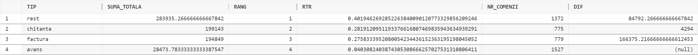
